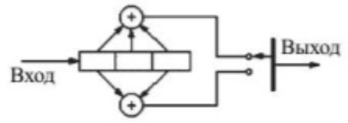

#### Сети и системы передачи информации ✔ ♿ ❌

| Вопрос                                                       | Статус    |
| ------------------------------------------------------------ | --------- |
| **Р1. Характеристики и структура системы передачи**          | **-----** |
| 1. Дайте определение понятиям «информация» и «сообщение».    | ✔         |
| 2. Перечислите основные характеристики источника дискретных сообщений. | ✔         |
| 3. Чем определяется количество информации в дискретном сообщении. | ✔         |
| 4. Что такое энтропия источника и как она определяется.      | ✔         |
| 5. Дайте определение основным параметрам цифровых сигналов данных. | ✔         |
| 6. Виды сигналов в системах передачи данных.                 | ✔         |
| 7. Нарисуйте и поясните структурную схему системы передачи дискретных сообщений. | ✔         |
| 8. Перечислите какие каналы выделяются в составе общей структурной схемы системы передачи данных. | ✔         |
| 9. Что такое непрерывный канал связи?                        | ✔         |
| 10. Назовите основные характеристики непрерывного канала связи. | ✔         |
| 11. Нарисуйте модель непрерывного канала связи и поясните смысл входящих в неё элементов | ✔         |
| 12. Какие элементы общей структурной схемы системы передачи данных входят в дискретный канал | ✔         |
| 13. Характеристики каналов связи.                            | ✔         |
| 14. Источники помех в каналах связи.                         | ✔         |
| 15. Виды линий связи.                                        | ✔         |
| 16. Первичные параметры проводных линий связи.               | ✔         |
| 17. Вторичные параметры проводных линий связи.               | ✔         |
| **Р2. Коммутация в сетях передачи данных**                   | **-----** |
| 1. Что такое коммутация? Какие виды сигналов могут коммутироваться? | ✔         |
| 2. Суть коммутации каналов.                                  | ✔         |
| 3. Суть коммутации пакетов.                                  | ✔         |
| 4. Достоинства и недостатки имеет коммутация каналов.        | ✔         |
| 5. Достоинства и недостатки имеет коммутация пакетов.        | ✔         |
| 6. Какие используются способы передачи пакетов?              | ✔         |
| 7. Суть датаграммного способа передачи пакетов.              | ✔         |
| 8. Особенность передачи пакетов с установлением логического канала. | ✔         |
| 9. Особенность передачи пакетов с установлением виртуального канала. | ✔         |
| 10. Что стандартизирует модель OSI?                          | ✔         |
| 11. Общая характеристика модели OSI                          | ✔         |
| 12. Уровни модели OSI                                        | ✔         |
| **Р3. Кодирование и мультиплексирование в сетях передачи данных** | **-----** |
| 1. Методы кодирования дискретного источника информации.      | ❌         |
| 2. Суть равномерного кодирования дискретного источника информации. | ❌         |
| 3. Суть неравномерного кодирования дискретного источника информации. | ❌         |
| 4. Кодирование Хаффмана.                                     | ❌         |
| 5. Кодирование Шеннона-Фано.                                 | ❌         |
| 6. Кодирование целых чисел.                                  | ❌         |
| 7. Алгоритмы обратимого сжатия.                              | ❌         |
| 8. Алгоритм кодирования Лемпела-Зива.                        | ❌         |
| 9. Кодирование длин серий                                    | ❌         |
| 10.Кодирование аналоговой информации аналоговыми сигналами.  | ❌         |
| 11.Аналоговая модуляция и ее виды.                           | ❌         |
| 12.Суть амплитудной модуляции.                               | ❌         |
| 13.Суть частотной модуляции.                                 | ❌         |
| 14.Суть фазовой модуляции                                    | ❌         |
| 15.Импульсная модуляция и ее виды                            | ❌         |
| 16.Кодирование аналоговой информации цифровыми сигналами     | ❌         |
| 17.Аналого-цифровое и цифро-аналоговое преобразование. Теорема Котельникова | ❌         |
| 18.Суть импульсно-кодовой модуляции.                         | ❌         |
| 19.Кодирование дискретной информации аналоговыми сигналами.  | ❌         |
| 20.Цифровая модуляция и ее виды.                             | ❌         |
| 21.Суть цифровой амплитудной модуляции.                      | ❌         |
| 22.Суть цифровой частотной модуляции.                        | ❌         |
| 23.Суть цифровой фазовой модуляции.                          | ❌         |
| 24.Квадратурная цифровая амплитудная модуляция.              | ❌         |
| 25.Квадратурная цифровая фазовая модуляция.                  | ❌         |
| 26.Линейное кодирование.                                     | ❌         |
| 27.Перечислить требования к методам цифрового кодирования.   | ❌         |
| 28.Суть однополярного линейного кодирования.                 | ❌         |
| 29.Суть полярного линейного кодирования.                     | ❌         |
| 30.Суть биполярного линейного кодирования.                   | ❌         |
| 31.Достоинства и недостатки метода кодирования NRZ.          | ❌         |
| 32.Достоинства и недостатки метода кодирования RZ.           | ❌         |
| 33.Достоинства и недостатки метода Манчестерского кодирования. | ❌         |
| 34.Достоинства и недостатки метода кодирования MLT-3.        | ❌         |
| 35.Достоинства и недостатки метода кодирования AMI.          | ❌         |
| **Р4. Обнаружение и коррекция ошибок в сетях передачи данных** | **-----** |
| 1. Основы помехоустойчивого кодирования.                     | ❌         |
| 2. Теорема кодирования для каналов с помехами Шеннона.       | ❌         |
| 3. Принципиальные особенности передачи сообщений по дискретному каналу с ошибками. | ❌         |
| 4. Оценка корректирующей способности кода.                   | ❌         |
| 5. Суть блочного кодирования                                 | ❌         |
| 6. Код с проверкой на четность.                              | ❌         |
| 7. Итеративный код.                                          | ❌         |
| 8. Код Хэмминга.                                             | ❌         |
| 9. Суть полиномиального кодирования.                         | ❌         |
| 10.Общая характеристика циклических кодов.                   | ❌         |
| 11.Основные свойства циклических кодов.                      | ❌         |
| 12.Циклические избыточные коды.                              | ❌         |
| 13.Код Боуза-Чоудхури-Хоккенгема.                            | ❌         |
| 14.Основные характеристики сверточных кодов.                 | ❌         |
| 15.Основные элементы сверточного кодера.                     | ❌         |
| 16.Диаграмма состояний сверточного кодера.                   | ❌         |
| 17.Алгоритм декодирования Витерби.                           | ❌         |
| **Р4. Безопасность систем и сетей передачи информации**      | **-----** |
| 1. Идентификация, аутентификация и авторизация.              | ♿         |
| 2. Модели информационной безопасности.                       | ♿         |
| 3. Уязвимость, угроза, атака.                                | ♿         |
| 4. Типы и примеры атак.                                      | ♿         |
| 5. Иерархия средств защиты.                                  | ♿         |
| 6. Технологии безопасности на основе анализа сетевого трафика | ♿         |
| 7. Системы мониторинга трафика.                              | ♿         |
| 8. Аудит событий безопасности.                               | ❌         |
| 9. Типовые архитектуры сетей, защищаемых файерволами.        | ❌         |
| 10.Атаки на транспортные протоколы.                          | ❌         |
| 11.Атаки на DNS.                                             | ❌         |
| 12.Безопасность маршрутизации на основе BGP.                 | ❌         |
| 13.Технологии защищенного канала.                            | ❌         |

| Задание                                                      | Статус |
| ------------------------------------------------------------ | ------ |
| 1. Построить методом Хаффмана оптимальный код для алфавита со следующим распределением вероятностей появления символов в тексте: А–0,4; Б – 0,2; В – 0,2; Г – 0,15; Д – 0,05. | ✔      |
| 2. Построить методом Шеннона-Фано оптимальный код для алфавита соследующим распределением вероятностей появления символов в тексте: А –0,4; Б – 0,2; В – 0,2; Г – 0,15; Д – 0,05. | ✔      |
| 3. Осуществить кодирование данных с помощью итеративного кода дляинформационной последовательности 101001110. | ✔      |
| 4. Провести проверку принятых данных 1110 0011 1100 0100 закодированныхс помощью итеративного кода (длина блока 3). | ✔      |
| 5. Вычислить CRC код (порождающий полином х4+х+1) для информационнойпоследовательности 11000100110101. | ✔      |
| 6. Провести проверку принятых данных 100001001101010111 закодированныхс помощью CRC кода (порождающий полином х4+х+1). | ✔      |
| 7. Осуществить кодирование данных с помощью кода Хэмминга (4,3) для информационной последовательности 0101. | ✔      |
| 8. Провести проверку принятых данных 0101101 закодированных с помощьюкода Хэмминга (4,3). | ✔      |
| 9. Провести кодирование последовательности символов «kababababaababz» пометоду Лемпеля-Зива (LZ78). | ✔      |
| 10. Для сверточного кодера (2,1,3) (схема приведена на рисунке) получить закодированный сигнал, если на вход поступает информационная последовательность символов 101.   | ✔      |

