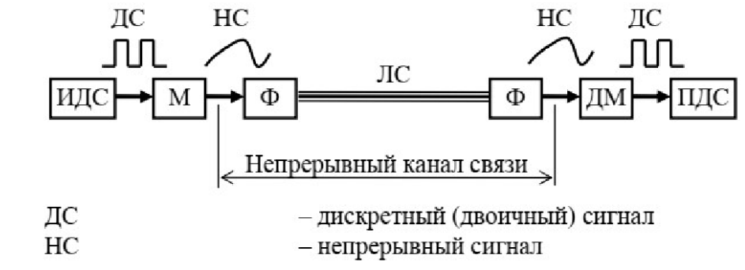

#### Вопрос 11

##### Нарисуйте модель непрерывного канала связи и поясните смысл входящих в неё элементов	

Каноническая схема системы связи Ha основе непрерывного канала связи для передачи двоичных сигналов, содержит:

* источник двоичных сигналов (ИДС) - источник сообщения
* модулятор (М) - производит модуляцию сигнала (процесс изменения одного или нескольких параметров модулируемого несущего сигнала при помощи модулирующего сигнала)
* фильтры (Ф);
* демодулятор (ДМ) - обратный процесс модуляции 
* приёмник двоичных сигналов (ПДС) - приемник сообщения