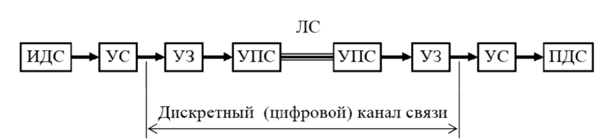

#### Вопрос 12

##### Какие элементы общей структурной схемы системы передачи данных входят в дискретный канал

Каноническая схема системы связи на основе дискретного (цифрового) канала связи содержит:

* устройство сопряжения с каналом связи (УС);
* устройство защиты от ошибок (УЗО - кодер и декодер канала);
* устройство преобразования сигналов (УПС - модулятор и демодулятор). 