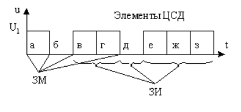

#### Вопрос 05

##### Дайте определение основным параметрам цифровых сигналов данных

Рассмотрим далее основные определения, относящиеся к ЦСД. Представляющий (информационный) параметр сигнала данных - параметр сигнала данных, изменение которого отображает изменение сообщения. На рисунке ниже изображен ЦСД, представляющим параметром которого является амплитуда, а множество возможных значений представляющего параметра равно двум $(U=U_1$ и $U=0)$. 

*Элемент ЦСД* - часть цифрового сигнала данных, отличающаяся от остальных частей значением одного из своих представляющих параметров. 

*Значащая позиция* - фиксируемое значение состояния представляющего параметра сигнала. 

*Значащим моментом (ЗМ)* - момент, в который происходит смена значащей позиции сигнала. 

*Значащим интервалом времени* - интервал времени между двумя соседними значащими моментами сигнала. 

*Единичный интервал*- минимальный интервал времени, которому равны значащие интервалы времени сигнала, (интервалы а-6, б-в и другие на рис). 

*Единичный элемент (е.э.)* - элемент сигнала, имеющий длительность, равную единичному интервалу времени. Различают изохронные и анизохронные сигналы данных. 

*Изохронные сигналы* это сигналы для которых любой значащий интервал времени равен единичному интервалу или их целому числу. 

*Анизохронными* называются сигналы, элементы которых могут иметь любую длительность, но не менее чем $\tau_{min}$. Кроме того, анизохронные сигналы могут отстоять друг от друга на произвольном расстоянии. 