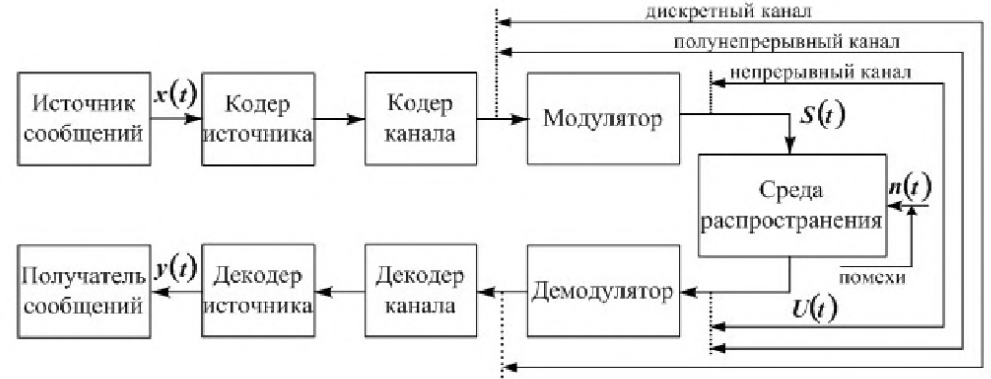

#### Вопрос 7

##### Нарисуйте и поясните структурную схему системы передачи дискретных сообщений

**Кодер источника**. Сообщение, поступающее от источника сообщений, в ряде случаев содержит избыточность. Это обусловлено тем, что символы $a\in A$, входящие в сообщение, могут быть статистически связаны. Это позволяет часть сообщения не передавать, восстанавливая его на приеме по известной статистической связи. 

Избыточность приводит к тому, что за заданный промежуток времени будет передано меньше сообщений, и, следовательно, менее эффективно будет использоваться канал передачи дискретных сообщений. Задачу устранения избыточности на передаче в СПДС выполняет кодер источника. 

**Кодер канала**. С целью повышения верности передачи используется избыточное кодирование, позволяющее на приеме обнаруживать или даже исправлять ошибки. 

В процессе кодирования осуществляется преобразование исходной кодовой комбинации в другую кодовую комбинацию с избыточностью. На приемном конце декодер канала осуществляет обратное преобразование (декодирование), в результате которого получаем комбинацию исходного кода. Часто кодер и декодер канала называют устройствами защиты от ошибок (УЗО). 

**Устройство преобразования сигнала**. С целью согласования кодера канала и декодера канала с непрерывным каналом связи используются на передаче и приеме устройства преобразования сигналов (УПС). В частном случае это модулятор и демодулятор.