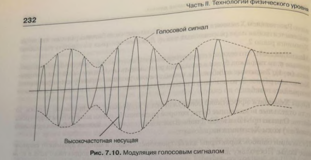

#### Раздел 3

##### Вопрос 10

##### Кодирование аналоговой информации аналоговыми сигналами.

Исторически модуляция начала применяться именно для кодирования аналоговой информации и только потом - для дискретной.

Необходимость в модуляции аналоговой информации возникает, когда нужно передать низкочастотный аналоговый сигнал через канал, находящийся в высокочастотной области спектра. Примером такой ситуации является передача голоса по радио или телевиденью. голос имеет спектр шириной примерно в 10 кГц, а радиодиапазоны включают гораздо более высокие частоты, от 30 кГц до 300МГц. Еще более высокие частоты используются в телевидении. Очевидно, что непосредственно голос через такую среду передать нельзя.

Для решения проблемы амплитуду высокочастотного несущего сигнала изменяют (модулируют) в соответствии с изменением низкочастотного голосового сигнала (рис.7.10). при этом спектр результирующего сигнала попадает в нужный высокочастотный диапазон. Такой тип модуляции называется амплитудной модуляцией (Amplitude Modulation, AM). 

В качестве информационного параметра используют амплитуду несущего синусоидального сигнала, но и частоту. В этих случаях мы имеем дело с частотной модуляцией (Frequency Modulation, FM). заметим. что при модуляции аналоговой информации фаза как информационный параметр не применяется. 

