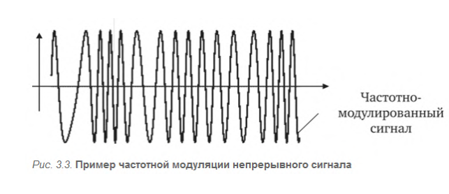

#### Раздел 3

##### Вопрос 11

##### Аналоговая модуляция и ее виды.

При аналоговой модуляции несущий сигнал представляет собой  непрерывные гармонические колебания высокой частоты. Сообщение также  представляется в виде непрерывной функции времени. Возможны три основных типа аналоговой модуляции: 

1) Амплитудная модуляция предполагает изменение амплитуды сигнала  во времени:

$x_{AM}(t) = A(t)sin(\omega t + \phi)$,

 

2) Частотная модуляция — это вид аналоговой модуляции, при котором  информационный сигнал управляет частотой несущего колебания. При  этом амплитуда несущего сигнала, как правило, остается постоянной.  Вид частотно-модулированного сигнала можно представить функцией времени:

$x_{ЧМ}(t) = Asin(\omega(t) t + \phi)$,

Можно показать, что $\omega(t) t+\phi = \omega_0t + \theta(t) +\theta_0 $,таким образом, частотная  и фазовая модуляция — это два варианта технической реализации одного  вида модуляции, называемого угловой модуляцией.
