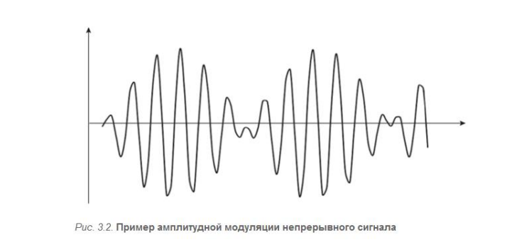

#### Раздел 3

##### Вопрос 12

##### Суть амплитудной модуляции.

Амплитудная модуляция предполагает изменение амплитуды сигнала  во времени:

$x_{AM}(t) = A(t)sin(\omega t + \phi)$,

 

При амплитудной модуляции для логической единицы выбирается  один уровень амплитуды синусоиды несущей частоты, а для  логического нуля – другой. Этот способ редко используется в чистом  виде на практике из-за низкой помехоустойчивости, но весьма часто  применяется в сочетании с другим видом модуляции – фазовой  модуляцией.
