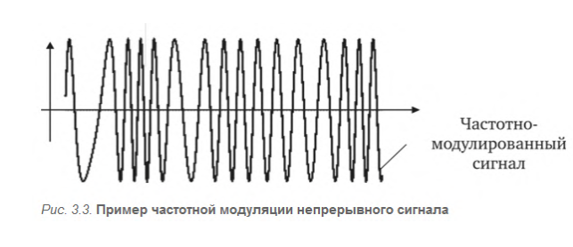

#### Вопрос 13

##### Суть частотной модуляции.

Частотная модуляция — это вид аналоговой модуляции, при котором  информационный сигнал управляет частотой несущего колебания. При  этом амплитуда несущего сигнала, как правило, остается постоянной.  Вид частотно-модулированного сигнала можно представить функцией времени:

$x_{ЧМ}(t) = Asin(\omega(t) t + \phi)$,

При частотной модуляции значения нуля и единицы исходных данных  передаются синусоидами с различной частотой -- 𝑓0 и 𝑓1. Этот способ модуляции не требует сложных схем и обычно применяется в  низкоскоростных модемах, работающих на скоростях 300 и 1200 бит/с
