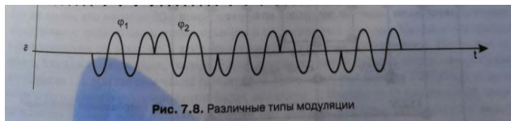

#### Вопрос 14

##### Суть фазовой модуляции

Фазовая модуляция предполагает, что модулирующим параметром  сигнала является фазовый сдвиг:

$x_{ФМ}(t)=Asin(\omega t + \phi(t))$

Можно показать, что $\omega(t) t+\phi = \omega_0t + \theta(t) +\theta_0 $,таким образом, частотная  и фазовая модуляция — это два варианта технической реализации одного  вида модуляции, называемого угловой модуляцией.

При фазовой модуляции значениям данных 0 и 1 соответствуют сигналы одинаковой частоты, но различной фазы, например, 0 и $180\degree$ или $0, 90, 180$ и $270\degree$ (рис.7.8). В первом случае такая модуляции носит название двоичной фазовой манипуляции (Binary PSK, BPSK), а во втором - квадратурной фазовой манипуляции (Quadrature PSK, QPSK).

