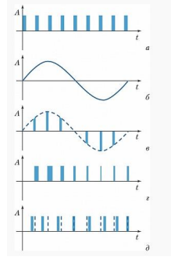

#### Раздел 3

##### Вопрос 15

##### Импульсная модуляция и ее виды

И́МПУЛЬСНАЯ МОДУЛЯ́ЦИЯ, изменение по определённому закону параметров последовательности импульсных сигналов для передачи информации.  В качестве модулируемой величины выбираются амплитуда импульса, его  ширина, положение в последовательности импульсов и другие.

На рисунке представлены различные виды импульсной модуляции. 

1) Периодические последовательности импульсных сигналов (рис., а)

2) На примере кодирования сигнала синусоидальной формы (рис., б).

3) При амплитудно-импульсной модуляции изменяется амплитуда прямоугольных импульсов (рис., в)

4) При широтно-импульсной – длительность (ширина) импульсов (рис., г)

5) При фазово-импульсной – местоположение импульсов относительно импульсов тактовой (синхронизирующей) последовательности (рис., д). 

Частотно-импульсная модуляция схожа с фазово-импульсной модуляцией. В  оптическом или радиодиапазоне используется т. н. двойная модуляция, когда  наряду с изменением параметров последовательности импульсов модулируют их высокочастотное заполнение.

