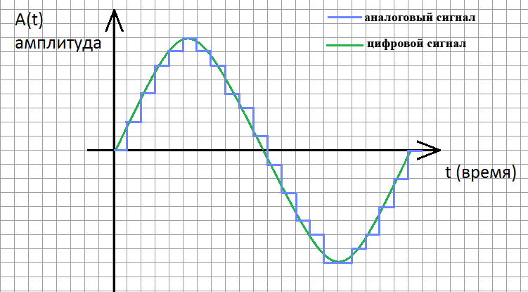

#### Вопрос 16

##### Кодирование аналоговой информации цифровыми сигналами.

В этой технике используется так называемая **дискретная модуляция** исходных непрерывных во времени аналоговых процессов. Амплитуда исходной непрерывной функции измеряется с заданным периодом — за счет этого происходит *дискретизация по времени*. Затем каждый замер представляется в виде двоичного числа определенной разрядности, что означает *дискретизацию по значениям* — непрерывное множество возможных значений амплитуды заменяется дискретным множеством ее значений.

Устройство, которое выполняет подобную функцию, называется **аналогово-цифровым преобразователем** (АЦП).

