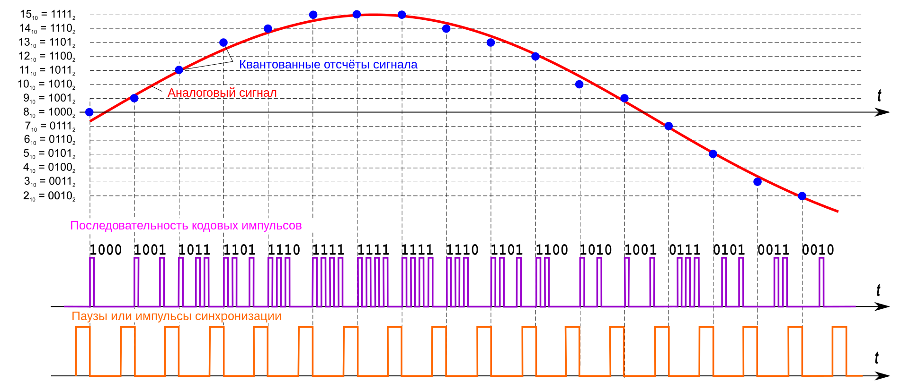

#### Вопрос 18

##### Суть импульсно-кодовой модуляции.

Для представления голоса в цифровой форме используются: различные методы его дискретизации. Наиболее простой метод оцифровывания голоса, в котором применяется частота квантования амплитуды звуковых колебаний в 8000 Гц, известен как метод **импульсно-кодовой модуляции** (Pulse Code Modulation, **РСМ**).

