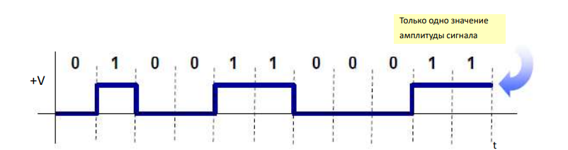
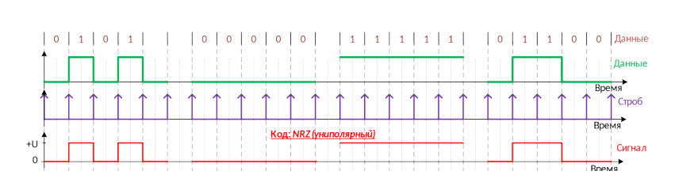

#### Раздел 3

##### Вопрос 28

##### Суть однополярного линейного кодирования.

УНИПОЛЯРНЫЙ – В этом типе метода линейного кода уровни  сигнала лежат выше или ниже оси

Схемы униполярного кодирования используют один уровень напряжения для представления данных. В этом случае для представления двоичного 1 передается высокое напряжение, а для представления 0 напряжение не передается.

NRZ- (non return to zero) код (код без возвращения к нулю) - один из способов линейного (физического) кодирования, используется при передаче дискретных сообщений в канале связи, формируя сигнал, передаваемый на расстояние.

NRZ - это особый тип униполярного кодирования, в котором  положительные напряжения обозначают бит 1, а нулевое напряжение определяет бит 0.

