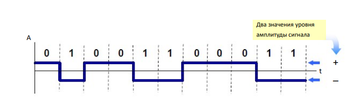

#### Вопрос 29

##### Суть полярного линейного кодирования.

Схема полярного кодирования использует несколько уровней напряжения для представления двоичных значений.

NRZL код (Non-retrurn-to-zero) (код без возвращения к нулю) — один из способов линейного кодирования, два уровня –А и +А для амплитуды импульса используются для выделения двоичных 1 и 0.

Без возврата к нулю (NRZ) – Этот NRZ также чем-то похож на униполярный NRZ, но в  случае Polar NRZ делится на две части, т.е. NRZ-L и NRZ-I уровень.

На уровне NRZ-L значения битов определяются уровнем напряжения. Здесь двоичный 0  относится к низкому логическому уровню, а бит 1 относится к высокому логическому  уровню.

На уровне NRZ-I, когда логика относится к биту 1, двухуровневый переход происходит на  границе, а когда логический уровень относится к 0, переход на границе не происходит.

• NRZ (БВН) : нет изменений сигнала внутри бита 

• NRZ-L : Код без возвращения к нулю, по уровню 

• 0 = положительный уровень, 1 = отрицательный 

• Недостатки NRZ-L кода: 

- • Наличие постоянной составляющей (DC)
-  • Потеря синхронизации

