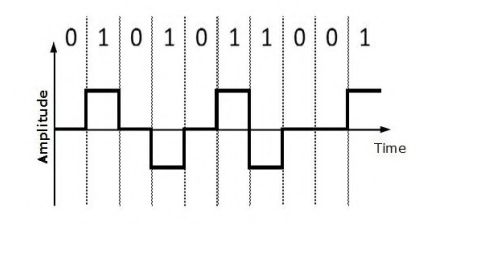

#### Вопрос 30

##### Суть биполярного линейного кодирования.

В этом типе кодирования существует три различных уровня  напряжения; они есть положительный, отрицательный и ноль. В  котором один из них находится на нуле, а другие уровни напряжения  остаются положительными и отрицательными.

К преимуществам кода относятся:

- самосинхронизирующийся код (слабая синхронизация в сравнении с манчестерским кодированием, поскольку синхронизация не производится при передаче логических нулей);
- спектр сигнала уже, чем у NRZ. 

К недостаткам кода относятся: 

- мощность передатчика должна быть выше в сравнении с двухуровневым кодированием;
- сложность построения аппаратуры в сравнении с двухуровневым кодированием.
