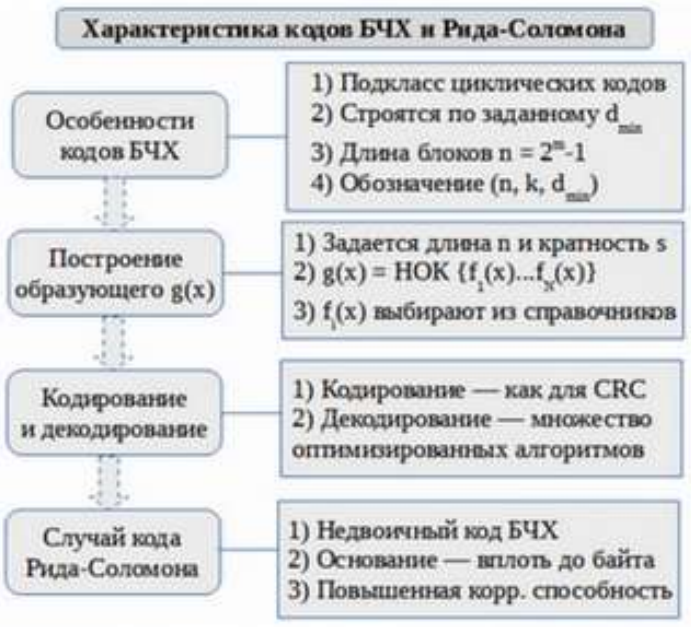

### Раздел 4

#### Вопрос 13

##### Код Боуза-Чоудхури-Хоккенгема.

Рассмотренные выше коды ориентированы на конкретные частные результаты: код Хэмминга исправляет однократные ошибки, а циклический — обнаруживает пачки ошибок с заданным ограничением по их длине.

Более общий подход — исправление ошибок любой заданной кратности — обеспечивают коды, созданные по методу Боуза, Чоудхури и Хоквингема (так называемые БЧХ-коды). 

К данному классу относится также популярный код Рида-Соломона, для которого вместо двоичных элементов могут использоваться например 16-ричные цифры. 

БЧХ-код является циклическим кодом, который задается порождающим многочленом g(x). Для построения кода БЧХ необходимо найти этот порождающий многочлен.

Нормированный многочлен — это такой многочлен, коэффициент при старшей степени которого равен 1. Например: $х^3+2х-1$ — нормированный многочлен, а $4х^2$-5 — нет. 

Любой многочлен можно привести к нормированному, разделив его на коэффициент при старшей степени.

