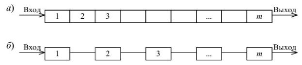
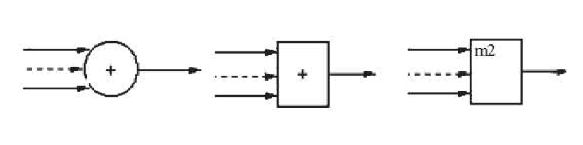
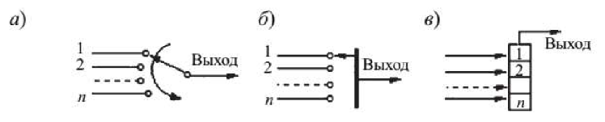

### Раздел 4

#### Вопрос 15

**Основные элементы свёрточного кодера**.

Основными элементы свёрточного кодера являются:

1. **Регистр сдвига** - динамическое запоминающее устройство, в котором хранятся двоичные символы 0 или 1.

   Число триггерных ячеек m в регистре сдвига и определяет память кода. В момент поступления на вход регистра нового информационного символа символ, хранящийся в крайнем правом разряде, выводится из регистра и сбрасывается.

   

2. **Сумматор по модулю 2** осуществляет сложение поступающих на его входы символов 0 и 1.

   В частности, для двухвходовой схемы
   $0\oplus0=0,1\oplus0=1,0\oplus1=1,1\oplus1=0$,
   где знаком $\oplus$ обозначается сложение по модулю 2.

3. **Коммутатор** осуществляет последовательное считывание поступающих на его входы символов и устанавливает на выходе очередность посылки кодовых символов в канал связи.

Тактовая частота переключения и число контактов коммутатора определяется **относительной скоростью кода R = R/n**, где k — число информативных символов; n — число передаваемых в канал связи символов за один такт поступления на кодер информационного символа.