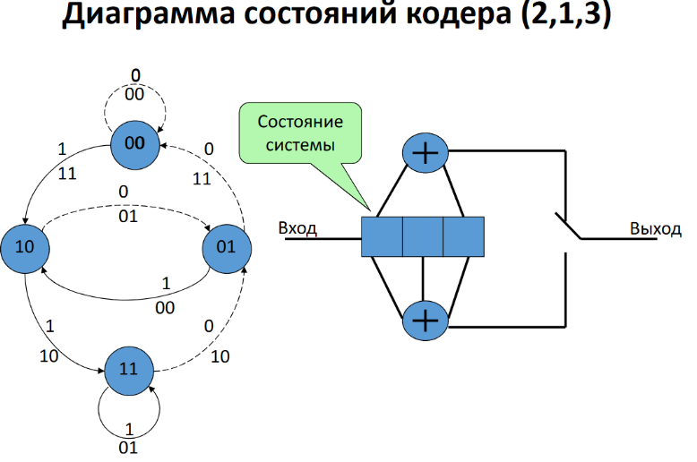

#### Вопрос 16

**Диаграмма состояний свёрточного кодера**.

**Сверточный кодер принадлежит к классу устройств называемых конечными автоматами** - это системы обладающие памятью о прошлых событиях (сигналах). 

При этом число состояний, в которых может находиться система - конечно. Состояние отражает информацию о прошлых событиях и определяет возможное поведение системы в будущем.

Состояние должно содержать минимум информации о прошлом на основание которой, совместно с текущими входными данными можно определить данные на выходе.

Из каждого текущего состояния возможны переходы лишь в некоторые из состояний и не возможны в другие.

Для сверточного кода со скоростью 1/n, состояний могут быть представлены содержимым (К-1) младших ячеек регистра.

Поступление следующего элемента будет определять как переход в следующее состояние, так и элементы на выходе кодера.

