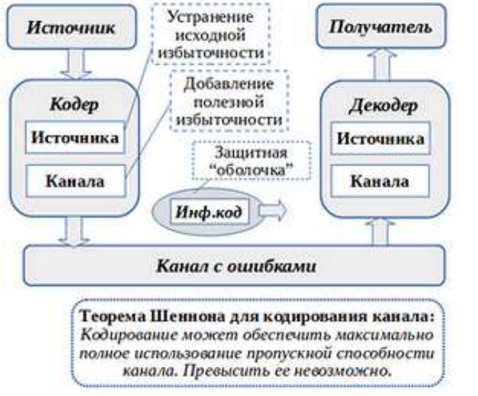

#### Вопрос 03

##### Принципиальные особенности передачи сообщений по дискретному каналу с ошибками.

Принципиальные особенности передачи сообщений по дискретному каналу с ошибками поясняет рисунок:

* Образно говоря, кодирование для передачи по каналу с ошибками создает “защитную оболочку”
  ean ее для передаваемого информационного кода. “Прочность” такой оболочки определяется избыточностью создаваемого кода. В минимальном варианте она позволяет фиксировать “повреждения”, а в максимальном — устранять их;
* Принято выделять два уровня кодирования: сжатие сообщений именуют кодированием источника, а защиту от ошибок — кодированием канала. На первом из уровней устраняется исходная избыточность. На втором, напротив, избыточность кода добавляется — но уже полезная, необходимая для устранения ошибок передачи;
* Для кодирования канала Клод Шеннон сформулировал и доказал теорему, суть в том, что всегда можно закодировать сообщения таким образом, что пропускная способность канала будет использована максимально полно (при этом преодолеть ограничение пропускной способности за счет кодирования невозможно);
* При видимом сходстве формулировок с теоремой для кодирования источника, смысл теоремы для кодирования канала куда менее очевиден. Действительно, интуитивно не ясно, как именно можно достоверно передавать информацию по каналу с ошибками. Ориентир, который дает теорема Шеннона, состоит в том, что за счет избыточного кодирования можно обеспечить достоверную передачу ценой увеличения ее длительности. Снижение пропускной способности канала как раз и означает увеличение необходимой длительности передачи (подобно тому, как установленный объем жидкости может пройти через меньшее сечение трубы за большее время).

