### Раздел 1

#### Вопрос 01

##### Дайте определение понятиям «информация» и «сообщение»

*Информация* — знания о предметах, фактах, идеях и т. д., которыми могут обмениваться люди в рамках конкретного контекста . Для хранения, обработки и преобразования информации используют условные символы (буквы, математические знаки, рисунки, формы колебаний, слова), позволяющие представить информацию в той или иной форме. 

*Данные* - представление фактов, понятий или инструкций в форме, приемлемой для общения, интерпретации, или обработки человеком или с помощью автоматических средств. 

Информация, выраженная в определенной — форме, предназначенная для передачи, называется *сообщением*.
#### Вопрос 02

##### Перечислите основные характеристики источника дискретных сообщений

Сообщение поступает от источника дискретных сообщений, который характеризуется алфавитом передаваемых сообщений $A=\{a_1,\dots,a_k\}$

*Алфавит* - есть совокупность всех возможных (различных) сообщений (знаков) данного источника. 

*Объем алфавита* - число различных символов алфавита К. Каждое сообщение алфавита появляется с некоторой вероятностью. 

*Вероятность* выдачи символа (сообщения) $a_i - p(a_i)$. 

*Количество информации в сообщении*(символе) определяется вероятностью его появления. Чем меньше вероятность появления того или иного сообщения, тем большее количество информации мы извлекаем при его получении. В 1928г. Хартли предложил определять количество информации, которое приходится на одно сообщение а,, выражением 
$$
I(a_i) = log_2\frac{1}{p(a_i)}=-log_2\;p(a_i)
$$

*Энтропия*. Среднее количество информации $H(A)$, которое приходится на одно сообщение, поступающее от источника без памяти, получим, применяя операцию усреднения по всему объему алфавита
$$
H(A) = -\sum\limits_{i=1}^kp(a_i)log_2\;p(a_i)
$$

#### Вопрос 03 
##### Чем определяется количество информации в дискретном сообщении
Количество информации в сообщении(символе) определяется вероятностью его появления. Чем меньше вероятность появления того или иного сообщения, тем большее количество информации мы извлекаем при его получении. В 1928г. Хартли предложил определять количество информации, которое приходится на одно сообщение $a_i$, выражением
$$
I(a_i) = log_2\frac{1}{p(a_i)}=-log_2\;p(a_i)
$$
#### Вопрос 04 

##### Что такое энтропия источника и как она определяется Энтропия. 

Среднее количество информации $H(A)$, которое приходится на одно сообщение, поступающее от источника без памяти, получим, применяя операцию усреднения по всему объему алфавита
$$
H(A)=-\sum\limits_{i=1}^kp(a_i)log_2\;p(a_i)
$$
Данное выражение известно как формула Шеннона для энтропии источника дискретных сообщений. Энтропия - мера неопределенности в поведении источника дискретных сообщений. Энтропия равна нулю, если с вероятностью единица источником выдается всегда одно и то же сообщение (в этом случае неопределенность в поведении источника сообщений отсутствует). Энтропия максимально, если символы источника появляются независимо и с одинаковой вероятностью.
#### Вопрос 05

##### Дайте определение основным параметрам цифровых сигналов данных

Рассмотрим далее основные определения, относящиеся к ЦСД. Представляющий (информационный) параметр сигнала данных - параметр сигнала данных, изменение которого отображает изменение сообщения. На рисунке ниже изображен ЦСД, представляющим параметром которого является амплитуда, а множество возможных значений представляющего параметра равно двум $(U=U_1$ и $U=0)$. 

*Элемент ЦСД* - часть цифрового сигнала данных, отличающаяся от остальных частей значением одного из своих представляющих параметров. 

*Значащая позиция* - фиксируемое значение состояния представляющего параметра сигнала. 

*Значащим моментом (ЗМ)* - момент, в который происходит смена значащей позиции сигнала. 

*Значащим интервалом времени* - интервал времени между двумя соседними значащими моментами сигнала. 

*Единичный интервал*- минимальный интервал времени, которому равны значащие интервалы времени сигнала, (интервалы а-6, б-в и другие на рис). 

*Единичный элемент (е.э.)* - элемент сигнала, имеющий длительность, равную единичному интервалу времени. Различают изохронные и анизохронные сигналы данных. 

*Изохронные сигналы* это сигналы для которых любой значащий интервал времени равен единичному интервалу или их целому числу. 

*Анизохронными* называются сигналы, элементы которых могут иметь любую длительность, но не менее чем $\tau_{min}$. Кроме того, анизохронные сигналы могут отстоять друг от друга на произвольном расстоянии. 
#### Вопрос 06

##### Виды сигналов в системах передачи данных

#### Вопрос 07

##### Нарисуйте и поясните структурную схему системы передачи дискретных сообщений

**Кодер источника**. Сообщение, поступающее от источника сообщений, в ряде случаев содержит избыточность. Это обусловлено тем, что символы $a\in A$, входящие в сообщение, могут быть статистически связаны. Это позволяет часть сообщения не передавать, восстанавливая его на приеме по известной статистической связи. 

Избыточность приводит к тому, что за заданный промежуток времени будет передано меньше сообщений, и, следовательно, менее эффективно будет использоваться канал передачи дискретных сообщений. Задачу устранения избыточности на передаче в СПДС выполняет кодер источника. 

**Кодер канала**. С целью повышения верности передачи используется избыточное кодирование, позволяющее на приеме обнаруживать или даже исправлять ошибки. 

В процессе кодирования осуществляется преобразование исходной кодовой комбинации в другую кодовую комбинацию с избыточностью. На приемном конце декодер канала осуществляет обратное преобразование (декодирование), в результате которого получаем комбинацию исходного кода. Часто кодер и декодер канала называют устройствами защиты от ошибок (УЗО). 

**Устройство преобразования сигнала**. С целью согласования кодера канала и декодера канала с непрерывным каналом связи используются на передаче и приеме устройства преобразования сигналов (УПС). В частном случае это модулятор и демодулятор.

**Модуляция** – перенос сигнала в заданную полосу частот путем изменения параметра (амплитуды, частоты, фазы) переносчика сигнала, называемого несущей, в соответствии с функцией, отображающей передаваемые данные.

*(из Основы кодирования, М.Вернер)*

Источник выдает сообщение, которое в общем виде представляет собой некоторый электрический сигнал. Аналоговый сигнал преобразуется в цифровую форму, удобную для дальнейшей обработки. Заметим, что аналого - цифровое преобразование, как правило, ограничивает полосу сигнала. Далее производится сжатие информации (*кодирование источника*). Кодирование источника удаляет несущественную информацию и минимизирует, а иногда и полностью устраняет избыточность сообщения. Таким образом, кодирование источника снижает затраты на храпение и передачу информации. Далее сообщение должно быть передано по зашумленному каналу. Для того, чтобы в дальнейшем сообщение могло быть доведено до потребителя в неискаженном виде, перед передачей в канал производится помехоустойчивое кодирование информации (*кодирование канала*). На приемном конце информация, поступающая из канала подвергается обратным преобразованиям. Декодер канала исправляет ошибки в принятом слове, а декодер источника преобразует исправленное слово в форму, удобную потребителю.
#### Вопрос 08

##### Перечислите какие каналы выделяются в составе общей структурной схемы системы передачи данных

**Непрерывный канал**. Это канал связи предназначенный для передачи непрерывных (аналоговых) сигналов. Например, абонентская телефонная линия, канал ТЧ. 

**Дискретный канал**. Совместно с каналом связи УПС образуют дискретный канал, то есть канал, предназначенный для передачи только дискретных сигналов (цифровых сигналов данных). 

Различают *синхронные* и *асинхронные* дискретные каналы. 

В синхронных дискретных каналах ввод каждого единичного элемента производится в строго определенные моменты времени и они предназначены для передачи только изохронных сигналов. По асинхронному каналу можно передавать любые сигналы - изохронные, анизохронные. 

**Расширенный канал**. Дискретный канал в совокупности с кодером и декодером канала (УЗО) называется расширенным дискретным каналом (РДК). 

В технике передачи данных РДК называют каналом передачи данных. 

**Полунепрерывный канал** (дискретный канал непрерывного времени). Для определения выхода данного канала необходимо более детально рассмотреть УПС приема. Он состоит из демодулятора, порогового устройства и регенератора. Выход ПУ одновременно является и выходом дискретного канала непрерывного времени. 

Если на выходе дискретного канала имеем сигнал, являющийся дискретной функцией дискретного времени, то на выходе полунепрерывного канала сигнал является дискретной функцией непрерывного времени. (Он же канал постоянного тока). 
#### Вопрос 09

##### Что такое непрерывный канал связи?

Это канал связи предназначенный для передачи непрерывных (аналоговых) сигналов. Например, абонентская телефонная линия, канал ТЧ. 
#### Вопрос 10 

##### Назовите основные характеристики непрерывного канала связи 

Основными характеристиками непрерывных каналов связи являются: 

* амплитудно-частотная характеристика - показывает как затухает амплитуда на выходе канала связи по сравнению с амплитудой на его входе для всех возможноых частот передаваемого сигнала
* полоса пропускания - опреде­ляет диапазон частот синусоидального сигнала, при которых этот сигнал передается по каналу связи без значительных искажений
* затухание - определяется как относительное уменьшение амп­литуды или мощности сигнала при передаче по каналу сигнала определенной частоты
* помехоустойчивость - определяет ее способность уменьшать уро­вень помех, создаваемых внешней средой, на внутренних проводниках
* шумы
* пропускная способность - характеризует максималь­но возможную скорость передачи данных по линии связи
* достоверность передачи данных - вероятность искажения для каждого передаваемого бита данных
* удельная стоимость
#### Вопрос 11

##### Нарисуйте модель непрерывного канала связи и поясните смысл входящих в неё элементов	

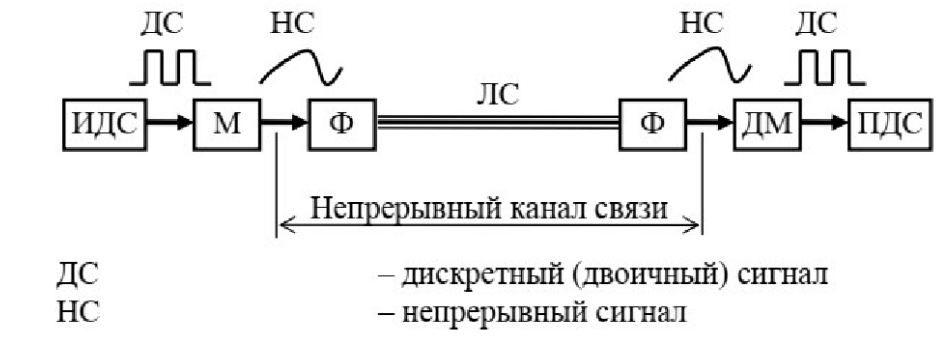

Каноническая схема системы связи Ha основе непрерывного канала связи для передачи двоичных сигналов, содержит:

* источник двоичных сигналов (ИДС) - источник сообщения
* модулятор (М) - производит модуляцию сигнала (процесс изменения одного или нескольких параметров модулируемого несущего сигнала при помощи модулирующего сигнала)
* фильтры (Ф);
* демодулятор (ДМ) - обратный процесс модуляции 
* приёмник двоичных сигналов (ПДС) - приемник сообщения
#### Вопрос 12

##### Какие элементы общей структурной схемы системы передачи данных входят в дискретный канал

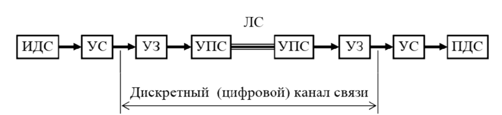

Каноническая схема системы связи на основе дискретного (цифрового) канала связи содержит:

* устройство сопряжения с каналом связи (УС) - убирает/добавляет избыточность
* устройство защиты от ошибок (УЗО - кодер и декодер канала) - делает помехоустойчивое кодирование/декодирование
* устройство преобразования сигналов (УПС - модулятор и демодулятор); 
#### Вопрос 13

##### Характеристики каналов связи

Если это непрерывный сигнал, то: 

* *Передаточная функция канала* представляется в виде амплитудно-частотной характеристики (АЧХ) и показывает, как затухает амплитуда синусоиды на выходе канала связи по сравнению с амплитудой на ее входе для всех возможных частот передаваемого сигнала. 
* *Скорость модуляции* — число интервалов модуляции передаваемого сигнала в секунду (число переключений, сделанных за секунду); величина, обратная единичному интервалу.
* *Пропускная способность канала связи* - количество данных, которое может быть передано по каналу связи за единицу времени. 
* *Достоверность передачи данных* — вероятность искажения бита из-за воздействия помех и наличия шумов в канале связи.
* *Затухание* определяется как относительное уменьшение амплитуды или мощности сигнала при передаче по каналу сигнала определенной частоты.

Если это дискретный канал, то:

* алфавит кодовых символов поступающих на его вход
* алфавит кодовых символов снимаемых с его выхода
* количество кодовых символов, пропускаемых в единицу времени
* значения вероятностей переходов $P(y_i/x_i)$, т.е. вероятностей того, что на выходе появится символ $y_i$, если на вход подан символ $x_i$ 
#### Вопрос 14

##### Источники помех в каналах связи

В реальной системе сигнал передается при наличии помех, под которыми понимаются любые случайные воздействия, накладывающиеся на сигнал $s(t)$ и затрудняющие его прием. В общем случае действие помех $n(t)$ можно описать с помощью оператора $V$, такого, что 
$$
u(t) = V[s(t),n(t)]
$$
где $u(t)$ - сигнал на вход приемника

Выделяют следующие виды помех

#### Вопрос 15

##### Виды линий связи.

#### Вопрос 16

##### Первичные параметры проводных линий связи

Первичные параметры характеризуют физическую природу линии связи:

1. Активное сопротивление
2. Индуктивность
3. Емкость
4. Проводимость
#### Вопрос 17

##### Вторичные параметры проводных линий связи

Вторичные параметры — параметры, которые определяются первичными параметрами и частотой входного сигнала, и определяются по отклику линии передачи на некоторые эталонные воздействия. К ним относятся: 

1. входное сопротивление линии;
2. постоянная распространения сигнала в линии связи. 
### Раздел 2

#### Вопрос 01

##### Что такое коммутация? Какие виды сигналов могут коммутироваться?

*Коммутация каналов и пакетов* - это методы решения обобщенной задачи коммутации данных в любой сетевой технологии.

*Коммутация в компьютерной сети* - процесс соединения абонентов такой сети через транзитные узлы. Абонентами могут выступать компьютеры, сегменты локальных сетей, принтеры или телефонные собеседники.

**TODO: хз что про виды сигналов написать... аналоговые и цифровые?**
#### Вопрос 02

##### Суть коммутации каналов.

Как правило, в сетях общего доступа невозможно предоставить каждой паре абонентов собственную физическую линию связи, которой они могли бы монопольно «владеть» и использовать в любое время. 

Поэтому в сети всегда применяется какой-либо способ коммутации абонентов, который обеспечивает разделение имеющихся физических каналов между несколькими сеансами связи и между абонентами сети.

*Коммутация каналов* (circuit switching) — организация составного канала через несколько транзитных узлов из нескольких последовательно «соединённых» каналов на время передачи сообщения (оперативная коммутация) или на более длительный срок (постоянная коммутация).
#### Вопрос 03

##### Суть коммутации пакетов.

Как правило, в сетях общего доступа невозможно предоставить каждой паре абонентов собственную физическую линию связи, которой они могли бы монопольно «владеть» и использовать в любое время. 

Поэтому в сети всегда применяется какой-либо способ коммутации абонентов, который обеспечивает разделение имеющихся физических каналов между несколькими сеансами связи и между абонентами сети.

*Коммутация пакетов* (packet switching) — разбиение сообщения на «пакеты», которые передаются отдельно. Если маршрут между узлами определён заранее, виртуальный канал (с установлением соединения). Если для каждого пакета задача нахождения пути решается заново, датаграммный (без установления соединения) способ пакетной коммутации.

Сети с коммутацией пакетов, состоят из коммутаторов, связанных физическими линиями связи.
#### Вопрос 04

##### Достоинства и недостатки имеет коммутация каналов.

*Преимущества сети с коммутацией каналов:*

1. После установления канала задержки в передаче данных нет. Так что это полезно при передаче данных в реальном времени, например, при голосовых вызовах. 
2. Канал связи выделен, что обеспечивает стабильную скорость передачи данных. 
3. На стороне получателя нет необходимости сортировать пакеты, поскольку все узлы следуют по одному и тому же пути и в одном и том же порядке. 

*Недостатки сети с коммутацией каналов:*

1. Поскольку канал является выделенным, его нельзя использовать для передачи каких-либо других данных, даже если подключенные системы не используют этот канал.
1.  Это дорого по сравнению с другими методами из-за требований к выделенному пути. 
1.  Время, необходимое для установления соединения между источником и получателем, велико. Это означает, что связь невозможна до тех пор, пока не будет установлено соединение и не будут доступны ресурсы. 
1.  Он в основном используется в голосовом трафике, поэтому не подходит для передачи данных.
#### Вопрос 05

##### Достоинства и недостатки имеет коммутация пакетов.

*Преимущества коммутации пакетов:*

1. Пакеты имеют фиксированный размер, поэтому коммутационные устройства не требуют больших вторичных запоминающих устройств. 

2. Не требуется наличие выделенных путей. 

3.  Если канал занят или недоступен, пакеты могут быть перенаправлены. Это обеспечивает надежное соединение.

4. Один и тот же канал может использоваться многими пользователями одновременно. 

   

*Недостатки коммутации пакетов*:

1. Их нельзя использовать для приложений, которые не допускают задержек, таких как высококачественные голосовые вызовы. 
2.  Протоколы, используемые при коммутации пакетов, сложны и требуют более высоких затрат на внедрение.
3.  Если сеть перегружена, пакеты могут быть потеряны или задержаны. Это может привести к потере важной информации. 
4. Сортировка полученных пакетов требуется на стороне получателя.
#### Вопрос 06

##### Какие используются способы передачи пакетов?

Коммутатор может работать на основании одного их трех методов продвижения пакетов:

- Дейтаграммная передача - все передаваемые пакеты обрабатыватся независимо друг от друга, выбор следующего узла происходит только на основании адресата узла назначения и независит от других пакетов; 
- Передача с установлением логического соединения - два конечных узла сети согласуют некоторые параметры процесса обмена пакетами;
- Передача с установлением виртуального канала - жестко определяется маршрут для всех пакетов.
#### Вопрос 07

##### Суть детаграммного способа передачи пакетов. (опечатка в вопросе: дейтаграммного )

*Дейтаграммный способ передачи данных* основан на том, что все передаваемые пакеты продвигаются независимо друг от друга на основании одних и тех же правил. 

*Дейтаграмма* – это основная единица передачи в сети с коммутацией пакетов; он состоит из заголовка, который содержит управляющую информацию, необходимую для его передачи по сети (IP-адрес и MAC-адрес отправителя и получателя), и данные.
#### Вопрос 08

##### Особенность передачи пакетов с установлением логического канала.

*Установление логического соединения* - процедура согласования двумя конечными узлами сети некоторых параметров процесса обмена пакетами.

*Параметрами логического соединения* – называются параметры, о которых договариваются два взаимодействующих узла. 

- Постоянные параметры; 
- Переменные параметры.

#### Вопрос 09

##### Особенность передачи пакетов с установлением виртуального канала.

Виртуальный канал (virtual channel) – единственный заранее проложенный фиксированный маршрут, соединяющий конечные узлы в сети с коммутацией пакетов.

#### Вопрос 10

##### Что стандартизирует модель OSI?

Термины «протокол» и «интерфейс» обозначают одно и то же - формализованное описание процедуры сетевого взаимодействия в телекоммуникацйионных и компьютерных системах, традиционно в сетях за ними закрепили разные области предпочтительного использования:

- *протоколы* определяют правила взаимодействия модулей одного уровня (одного ранга) в разных узлах;
- *интерфейсы* — правила взаимодействия модулей соседних уровней в одном узле. 

*Стек протоколов* – иерархически организованный набор протоколов, достаточный для организации взаимодействия узлов в сети.

В начале 80-х годов ряд международных организаций по стандартизации, в частности International Standards Organization (ISO), а также International Telecommunications Union (ITU) разработали стандартную модель взаимодействия открытых систем (Open System Interconnection, OSI).

**Модель OS**I имеет дело со стеком протоколов для сетей с коммутацией пакетов. 

**Модель OSI** не содержит описаний реализаций конкретного набора протоколов. Она лишь определяет, уровни взаимодействия и стандартные названия уровней, а также функции, которые должен выполнять каждый уровень.

#### Вопрос 11

##### Общая характеристика модели OSI

Модель OSI определяет уровни взаимодействия систем в сетях с коммутацией пакетов, стандартные названия уровней, функции, которые должен выполнять каждый уровень. *Модель OSI не содержит описаний реализаций* конкретного набора протоколов. Собственные протоколы взаимодействия приложения реализуют, обращаясь к системным средствам.

В модели OSI  средства взаимодействия делятся на **семь** уровней: при­кладной, представления, сеансовый, транспортный, сетевой, канальный и физи­ческий. Каждый уровень имеет дело с совершенно определенным аспектом взаи­модействия сетевых устройств.

Модель OSI имеет семь уровней. Появление именно такой структуры было обусловлено следующими соображениями.

1. Уровень должен создаваться по мере необходимости отдельного уровня абстракции.

2. Каждый уровень должен выполнять строго определенную функцию.

3. Выбор функций для каждого уровня должен осуществляться с учетом создания стандартизированных международных протоколов.

4. Границы между уровнями должны выбираться так, чтобы поток данных между интерфейсами был минимальным.

5. Количество уровней должно быть достаточно большим, чтобы различные функции не объединялись в одном уровне без необходимости, но не слишком высоким, чтобы архитектура не становилась громоздкой.

#### Вопрос 12

##### Уровни модели OSI

В модели OSI  средства взаимодействия делятся на **семь** уровней: при­кладной, представления, сеансовый, транспортный, сетевой, канальный и физи­ческий. Каждый уровень имеет дело с совершенно определенным аспектом взаи­модействия сетевых устройств.

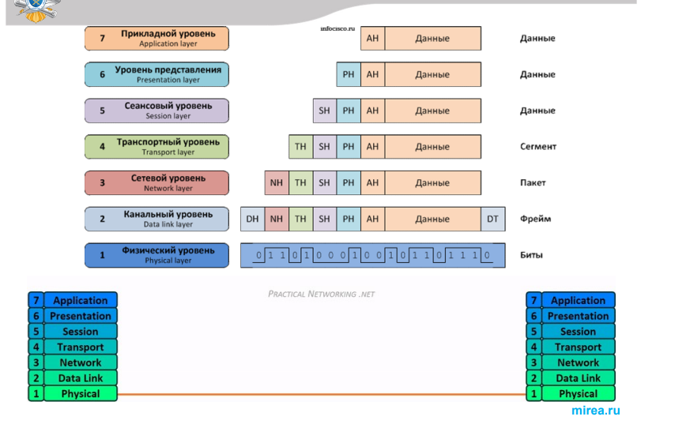

**Физический уровень **модели OSI имеет дело с передачей потока битов по физическим каналам связи, таким как витая пара, оптоволоконный кабель или беспроводная линия связи.

На этом уровне решают такие вопросы: 

- каким напряжением надо представлять 1, а каким - 0; 

- сколько микросекунд тратится на передачу одного бита; 

- следует ли поддерживать передачу данных в обоих направлениях одновременно;

- как устанавливается начальное соединение и как оно разрывается;

- каково количество контактов на сетевом разъеме, для чего используется каждый контакт.

  

**Канальный уровень (data link layer) модели**: при получении данных с физического уровня уровень канала передачи данных проверяет физические ошибки передачи и упаковывает биты в кадры данных.

- установление логического соединения между взаимодействующими узлами;

- согласование в рамках соединения скоростей передатчика и приемника информации;

- обеспечение надежной передачи, обнаружение и коррекция ошибок.

-  разбиение данных отправителя на фреймы – кадры (обычно от нескольких сотен до нескольких тысяч байтов), передачей фреймов последовательно и обработкой фреймов уведомления, поступающих от получателя; 

- канальный уровень помещает пакет в поле данных одного или нескольких кадров и заполняет собственной служебной информацией заголовок кадра.

  

**Сетевой уровень** служит для образования единой транспортной системы, объединяющей несколько сетей, называемой составной сетью или Интернет.

Технология, позволяющая соединять в единую сеть множество сетей, в общем случае построенных на основе разных технологий, называется технологией **межсетевого взаимодействия** (internetworking).

**Сетевой уровень добавляет концепцию маршрутизации над уровнем канала передачи данных. **

Когда данные поступают на сетевой уровень, адреса источника и назначения, содержащиеся в каждом кадре, проверяются, чтобы определить, достигли ли данные своего конечного пункта назначения.

Если данные достигли конечного пункта назначения, уровень 3 форматирует данные в пакеты, доставляемые на транспортный уровень.

В противном случае сетевой уровень обновляет адрес назначения и передает кадр вниз на нижние уровни.

**Основная задача сетевого уровня** - определение маршрута. 

**Маршрут** описывается последовательность сетей, через которые должны пройти пакет, чтобы попасть к адресату. 

Маршрутизатор собирает информацию о топологии связей между сетями и на основе этой информации строит таблицы коммутации (**таблицы маршрутизации**).

*На сетевом уровне определены два вида протоколов:*

- **Маршрутизируемые протоколы** – реализуют продвижение пакетов через сеть. 
- **Маршрутизирующие протоколы** (протоколы маршрутизации) – с помощью данных протоколов маршрутизатор собирает информацию о топологии межсетевых соединений, на основании которой осуществляется выбор маршрута продвижения пакетов.

**Транспортный уровень** (transport layer)  доставляет данные через сетевые соединения. Различные транспортные протоколы могут поддерживать ряд дополнительных возможностей, включая восстановление после ошибок, управление потоком и поддержку повторной передачи. 

Модель OSI определяет пять **классов транспортного сервиса** от низшего класса 0 до высшего класса 4: срочность, возможность восстановления прерванной связи, наличие средств мультиплексирования нескольких соединений между различными прикладными протоколами, способность к обнаружению и исправлению ошибок передачи (искажение, потеря, дублирование пакетов).

**Сеансовый уровень** управляет последовательностью и потоком событий, которые инициируют и разрывают сетевые соединения: фиксирует, какая из сторон является активной в настоящий момент, и предоставляет средства синхронизации сеанса.

- Сеанс позволяет передавать данные и создавать потоки данных.

- Потоки данных могут быть разрешены в обоих направлениях одновременно, либо поочередно в одном направлении.

- Сервис на сеансовом уровне будет управлять направлением передачи.

  

**Уровень представления**  (presentation layer)  

Уровень представления ведет синтаксическую обработку данных сообщения, таких как преобразование формата и шифрование / дешифрование, необходимые для поддержки прикладного уровня над ним. 

За счет уровня представления:

- информация, передаваемая прикладным уровнем одной системы, всегда понятна прикладному уровню другой системы;
- протоколы прикладных уровней могут преодолеть синтаксические различия в представлении данных или же различия в кодах символов.

**Прикладной уровень** – это набор разнообразных протоколов, с помощью которых пользователи сети получают доступ к разделяемым ресурсам (файлам, принтерам, гипертекстовым веб страницам, сервисам, например, электронная почта). 

Например, в приложении веб-браузера протокол прикладного уровня HTTP упаковывает данные, необходимые для отправки и получения содержимого веб-страницы.

### Раздел 3

#### Вопрос 10

##### Кодирование аналоговой информации аналоговыми сигналами.

Исторически модуляция начала применяться именно для кодирования аналоговой информации и только потом - для дискретной.

Необходимость в модуляции аналоговой информации возникает, когда нужно передать низкочастотный аналоговый сигнал через канал, находящийся в высокочастотной области спектра. Примером такой ситуации является передача голоса по радио или телевиденью. голос имеет спектр шириной примерно в 10 кГц, а радиодиапазоны включают гораздо более высокие частоты, от 30 кГц до 300МГц. Еще более высокие частоты используются в телевидении. Очевидно, что непосредственно голос через такую среду передать нельзя.

Для решения проблемы амплитуду высокочастотного несущего сигнала изменяют (модулируют) в соответствии с изменением низкочастотного голосового сигнала (рис.7.10). при этом спектр результирующего сигнала попадает в нужный высокочастотный диапазон. Такой тип модуляции называется амплитудной модуляцией (Amplitude Modulation, AM). 

В качестве информационного параметра используют амплитуду несущего синусоидального сигнала, но и частоту. В этих случаях мы имеем дело с частотной модуляцией (Frequency Modulation, FM). заметим. что при модуляции аналоговой информации фаза как информационный параметр не применяется. 

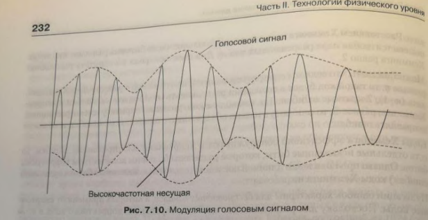

#### Вопрос 11

##### Аналоговая модуляция и ее виды.

При аналоговой модуляции несущий сигнал представляет собой  непрерывные гармонические колебания высокой частоты. Сообщение также  представляется в виде непрерывной функции времени. Возможны три основных типа аналоговой модуляции: 

1) Амплитудная модуляция предполагает изменение амплитуды сигнала  во времени:

$x_{AM}(t) = A(t)sin(\omega t + \phi)$,

 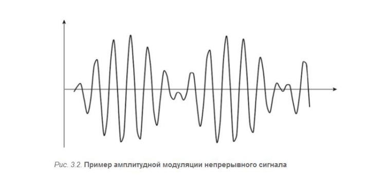

2) Частотная модуляция — это вид аналоговой модуляции, при котором  информационный сигнал управляет частотой несущего колебания. При  этом амплитуда несущего сигнала, как правило, остается постоянной.  Вид частотно-модулированного сигнала можно представить функцией времени:

$x_{ЧМ}(t) = Asin(\omega(t) t + \phi)$,

Можно показать, что $\omega(t) t+\phi = \omega_0t + \theta(t) +\theta_0 $,таким образом, частотная  и фазовая модуляция — это два варианта технической реализации одного  вида модуляции, называемого угловой модуляцией.

#### Вопрос 12

##### Суть амплитудной модуляции.

Амплитудная модуляция предполагает изменение амплитуды сигнала  во времени:

$x_{AM}(t) = A(t)sin(\omega t + \phi)$,

 

При амплитудной модуляции для логической единицы выбирается  один уровень амплитуды синусоиды несущей частоты, а для  логического нуля – другой. Этот способ редко используется в чистом  виде на практике из-за низкой помехоустойчивости, но весьма часто  применяется в сочетании с другим видом модуляции – фазовой  модуляцией.

#### Вопрос 13

##### Суть частотной модуляции.

Частотная модуляция — это вид аналоговой модуляции, при котором  информационный сигнал управляет частотой несущего колебания. При  этом амплитуда несущего сигнала, как правило, остается постоянной.  Вид частотно-модулированного сигнала можно представить функцией времени:

$x_{ЧМ}(t) = Asin(\omega(t) t + \phi)$,

При частотной модуляции значения нуля и единицы исходных данных  передаются синусоидами с различной частотой -- 𝑓0 и 𝑓1. Этот способ модуляции не требует сложных схем и обычно применяется в  низкоскоростных модемах, работающих на скоростях 300 и 1200 бит/с

#### Вопрос 14

##### Суть фазовой модуляции

Фазовая модуляция предполагает, что модулирующим параметром  сигнала является фазовый сдвиг:

$x_{ФМ}(t)=Asin(\omega t + \phi(t))$

Можно показать, что $\omega(t) t+\phi = \omega_0t + \theta(t) +\theta_0 $,таким образом, частотная  и фазовая модуляция — это два варианта технической реализации одного  вида модуляции, называемого угловой модуляцией.

При фазовой модуляции значениям данных 0 и 1 соответствуют сигналы одинаковой частоты, но различной фазы, например, 0 и $180\degree$ или $0, 90, 180$ и $270\degree$ (рис.7.8). В первом случае такая модуляции носит название двоичной фазовой манипуляции (Binary PSK, BPSK), а во втором - квадратурной фазовой манипуляции (Quadrature PSK, QPSK).

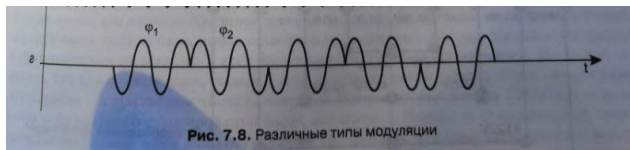

#### Вопрос 15

##### Импульсная модуляция и ее виды

Импульсная модуляция - изменение по определённому закону параметров последовательности импульсных сигналов для передачи информации.  В качестве модулируемой величины выбираются амплитуда импульса, его ширина, положение в последовательности импульсов и другие.

На рисунке представлены различные виды импульсной модуляции. 

1) Периодические последовательности импульсных сигналов (рис., а)

2) На примере кодирования сигнала синусоидальной формы (рис., б).

3) При амплитудно-импульсной модуляции изменяется амплитуда прямоугольных импульсов (рис., в)

4) При широтно-импульсной – длительность (ширина) импульсов (рис., г)

5) При фазово-импульсной – местоположение импульсов относительно импульсов тактовой (синхронизирующей) последовательности (рис., д). 

Частотно-импульсная модуляция схожа с фазово-импульсной модуляцией. В  оптическом или радиодиапазоне используется т. н. двойная модуляция, когда  наряду с изменением параметров последовательности импульсов модулируют их высокочастотное заполнение.

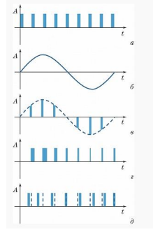

#### Вопрос 16

##### Кодирование аналоговой информации цифровыми сигналами.

В этой технике используется так называемая **дискретная модуляция** исходных непрерывных во времени аналоговых процессов. Амплитуда исходной непрерывной функции измеряется с заданным периодом — за счет этого происходит *дискретизация по времени*. Затем каждый замер представляется в виде двоичного числа определенной разрядности, что означает *дискретизацию по значениям* — непрерывное множество возможных значений амплитуды заменяется дискретным множеством ее значений.

Устройство, которое выполняет подобную функцию, называется **аналогово-цифровым преобразователем** (АЦП).

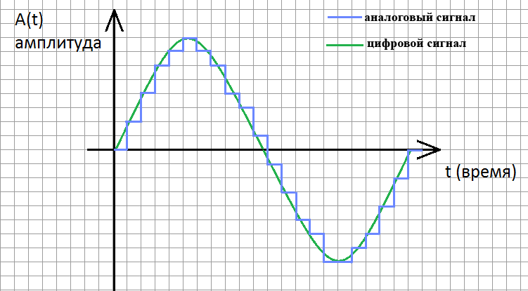

#### Вопрос 17

##### Аналого-цифровое и цифро-аналоговое преобразование. Теорема Котельникова.

В этой технике используется так называемая **дискретная модуляция** исходных
непрерывных во времени аналоговых процессов. Амплитуда исходной непрерывной функции
измеряется с заданным периодом — за счет этого происходит *дискретизация по времени*.
Затем каждый замер представляется в виде двоичного числа определенной разрядности, что означает *дискретизацию по значениям* — непрерывное множество возможных значений амплитуды заменяется дискретным множеством ее значений.

Устройство, которое выполняет подобную функцию, называется **аналогово-цифровым преобразователем** (АЦП). Затем замеры передаются по линиям связи в виде последовательности единиц и нулей. При этом применяются те же методы кодирования, что и при передаче изначально дискретной информации.

На приемной стороне линии коды преобразуются в исходную последовательность битов, а специальная аппаратура, называемая **цифро-аналоговым преобразователем** (ЦАП), производит демодуляцию оцифрованных амплитуд, восстанавливая исходную непрерывную функцию времени.

Дискретная модуляция основана на *теореме отображения Котельникова - Найквиста*. В соответствии с этой теоремой аналоговая непрерывная функция, переданная в виде последовательности её дискретных по времени значений, может быть точно восстановлена, если частота дискретизации была в два или более раз выше, чем частота самой высокой гармоники спектра исходной функции.

*(формулировка для чайников и самоваров)*

Для правильной дискретизации, чтобы не было искажений, необходимо взять частоту дискретизации не менее в два раза больше максимальной частоты сигнала

#### Вопрос 18

##### Суть импульсно-кодовой модуляции.

Для представления голоса в цифровой форме используются: различные методы его дискретизации. Наиболее простой метод оцифровывания голоса, в котором применяется частота квантования амплитуды звуковых колебаний в 8000 Гц, известен как метод **импульсно-кодовой модуляции** (Pulse Code Modulation, **РСМ**).

#### Вопрос 19

##### Кодирование дискретной информации аналоговыми сигналами.

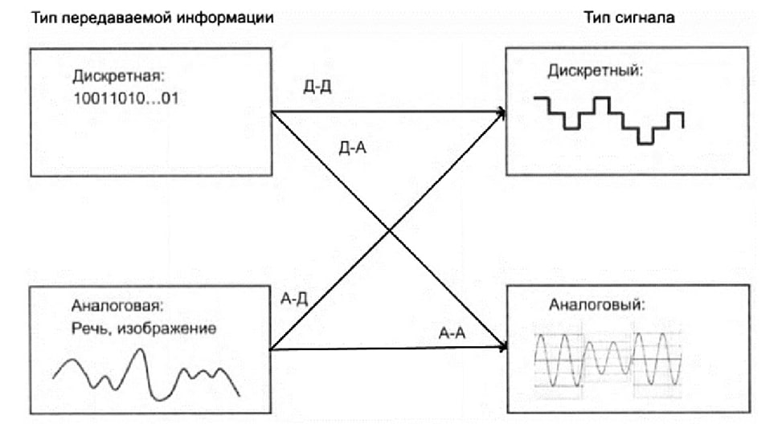

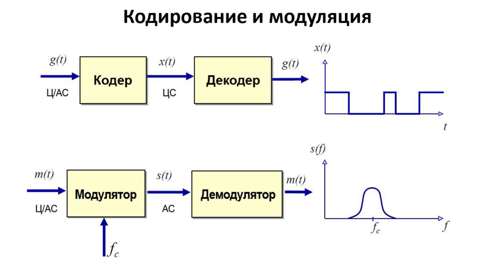

#### Вопрос 20

##### Цифровая модуляция и её виды.

Цифровая манипуляция -— это модуляция, при которой в качестве несущего сигнала используется гармоническая несущая а в качестве модулирующего сигнала используется дискретный, двоичный сигнал.

1. Амплитудная манипуляция.
2. Частотная манипуляция.
3. Фазовая манипуляция.

Частотная и фазовая манипуляция обладают высокой помехоустойчивостью, так как шумы искажают, как правило, амплитуду, а не частоту или фазу сигнала.

#### Вопрос 21

**Суть цифровой амплитудной модуляции**

**Цифровая** **амплитудная** **модуляция** включает в себя изменение амплитуды несущей волны в дискретных участках в соответствии с двоичными данными. Резкие переходы, связанные с цифровыми методами модуляции, создают (нежелательные) высокочастотные составляющие. Мы должны помнить об этом, когда рассматриваем фактическую ширину полосы частот модулированного сигнала и наличие частот, которые могут мешать другим устройствам.

#### Вопрос 22

**Суть цифровой частотной модуляции**

При **цифровой частотной модуляции** частота несущей или низкочастотного аналогового сигнала изменяется в дискретных участках в соответствии с двоичными данными. При частотной манипуляции каждому возможному значению передаваемого символа сопоставляется своя частота несущей, т.е. в течение любого символьного интервала передается гармоническое колебание с частотой, соответствующей текущему символу.

#### Вопрос 23

**Суть цифровой фазовой модуляции**

При цифровой фазовой модуляции скачкообразно меняется фаза несущего колебания. На практике цифровую фазовую манипуляцию применяют при небольшом числе возможных значений начальной фазы — как правило, 2, 4 или 8. Кроме того, при приеме сигнала сложно определить *абсолютное* значение начальной фазы; значительно проще измерить *относительный* фазовый сдвиг между двумя соседними символами.

#### Вопрос 24

**Суть квадратурной амплитудной модуляции**

Квадратурной амплитудной модуляцией называется модуляция, при которой изменяется как фаза, так и амплитуда сигнала, что позволяет увеличить количество информации, передаваемой одним состоянием (отсчётом) сигнала.

#### Вопрос 25

**Суть квадратурной фазовой модуляции**

Фазовая манипуляция (PSK) - это процесс цифровой модуляции, который передает данные путем изменения (модуляции) фазы опорного сигнала постоянной частоты (несущей волны). Модуляция осуществляется путем изменения входов синуса и косинуса в точное время. Широко используется для беспроводной локальной сети, RFID и Bluetooth-связи. Любая схема цифровой модуляции использует конечное число различных сигналов для представления цифровых данных. PSK использует конечное число фаз, каждой из которых присваивается уникальный набор двоичных цифр. Обычно каждая фаза кодирует равное количество битов. Каждый набор битов формирует символ, который представлен определенной фазой. Демодулятор, который разработан специально для набора символов, используемого модулятором, определяет фазу принятого сигнала и отображает его обратно в символ, который он представляет, восстанавливая таким образом исходные данные. Для этого требуется, чтобы приемник мог сравнивать фазу принятого сигнала с опорным сигналом – такая система называется когерентной (и называется CPSK).
#### Вопрос 26

##### Линейное кодирование.

Физи́ческое коди́рование (линейное кодирование, манипуляция сигнала, модуляция, импульсно-кодовая модуляция) — представления дискретных сигналов, передаваемых по цифровому каналу связи, с целью передачи данных, представленных в цифровом виде, на расстояние по физическому каналу связи (такому как оптическое волокно, витая пара, коаксиальный кабель, инфракрасное излучение). Физическое кодирование также применяется для записи данных на цифровой носитель. При физическом кодировании обращают внимание на характеристики формируемого сигнала: ширину полосы частот, гармонический состав сигнала, способность к синхронизации приёмника с передатчиком. При физическом кодировании решаются вопросы синхронизации, управления полосой пропускания сигнала, скорость передачи данных и расстояние на которое необходимо передать данные.

#### Вопрос 27

##### Перечислить требования к методам цифрового кодирования.

- имел при одной и той же битовой скорости наименьшую ширину спектра  результирующего сигнала;
- обеспечивал синхронизацию между передатчиком и приемником;  
- обладал способностью распознавать ошибки;
- обладал низкой стоимостью реализации

#### Вопрос 28

##### Суть однополярного линейного кодирования.

УНИПОЛЯРНЫЙ – В этом типе метода линейного кода уровни  сигнала лежат выше или ниже оси

Схемы униполярного кодирования используют один уровень напряжения для представления данных. В этом случае для представления двоичного 1 передается высокое напряжение, а для представления 0 напряжение не передается.

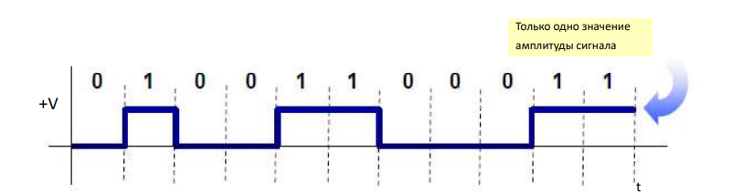

NRZ- (non return to zero) код (код без возвращения к нулю) - один из способов линейного (физического) кодирования, используется при передаче дискретных сообщений в канале связи, формируя сигнал, передаваемый на расстояние.

NRZ - это особый тип униполярного кодирования, в котором  положительные напряжения обозначают бит 1, а нулевое напряжение определяет бит 0.

#### Вопрос 29

##### Суть полярного линейного кодирования.

Схема полярного кодирования использует несколько уровней напряжения для представления двоичных значений.

NRZL код (Non-retrurn-to-zero) (код без возвращения к нулю) — один из способов линейного кодирования, два уровня –А и +А для амплитуды импульса используются для выделения двоичных 1 и 0.

Без возврата к нулю (NRZ) – Этот NRZ также чем-то похож на униполярный NRZ, но в  случае Polar NRZ делится на две части, т.е. NRZ-L и NRZ-I уровень.

На уровне NRZ-L значения битов определяются уровнем напряжения. Здесь двоичный 0  относится к низкому логическому уровню, а бит 1 относится к высокому логическому  уровню.

На уровне NRZ-I, когда логика относится к биту 1, двухуровневый переход происходит на  границе, а когда логический уровень относится к 0, переход на границе не происходит.

• NRZ (БВН) : нет изменений сигнала внутри бита 

• NRZ-L : Код без возвращения к нулю, по уровню 

• 0 = положительный уровень, 1 = отрицательный 

• Недостатки NRZ-L кода: 

- • Наличие постоянной составляющей (DC)
-  • Потеря синхронизации

#### Вопрос 30

##### Суть биполярного линейного кодирования.

В этом типе кодирования существует три различных уровня  напряжения; они есть положительный, отрицательный и ноль. В  котором один из них находится на нуле, а другие уровни напряжения  остаются положительными и отрицательными.

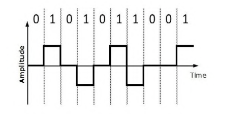

К преимуществам кода относятся:

- самосинхронизирующийся код (слабая синхронизация в сравнении с манчестерским кодированием, поскольку синхронизация не производится при передаче логических нулей);
- спектр сигнала уже, чем у NRZ. 

К недостаткам кода относятся: 

- мощность передатчика должна быть выше в сравнении с двухуровневым кодированием;
- сложность построения аппаратуры в сравнении с двухуровневым кодированием.

#### Вопрос 31

##### Достоинства и недостатки метода кодирования NRZ.

К достоинствам кода NRZ относятся:

- простая реализация (исходный сигнал не надо ни специально кодировать на передающем конце, ни декодировать на приемном конце);
- минимальная среди других кодов пропускная способность линии связи, требуемая при данной скорости передачи.

К недостаткам кода NRZ относятся:

- отсутствие свойства самосинхронизации, т.е. при наличии высокоточного тактового генератора приемник может ошибиться с выбором момента съема данных, так как частоты двух генераторов никогда не бывают полностью идентичными.

​		Поэтому при высоких скоростях обмена данными и длинных последовательностях единиц или нулей небольшое рассогласование тактовых частот может привести к ошибке в целый такт и, соответственно, считыванию некорректного значения бита.

#### Вопрос 32

##### Достоинства и недостатки метода кодирования RZ.

К достоинствам кода RZ относятся:

- позволяет избавиться от проблемы постоянного смещения за счёт противоположного потенциального уровня; 
- самосинхронизирующийся - состояние потенциала меняется на каждом значащем интервале, возможна синхронизация тактовой частоты приёмника и передатчика. 

К недостаткам кода RZ относятся:

- сложность реализации кодирующего устройства в сравнении с NRZ-кодом, поскольку требуется реализация трех потенциальных уровней.

#### Вопрос 33

##### Достоинства и недостатки метода Манчестерского кодирования.

К преимуществам кода относятся:

- самосинхронизация - наличие двух гарантированных переходов при передаче 1 бита позволяет сигналу быть самосинхронизирующимся, что позволяет приемнику (декодеру) правильно настроиться на скорость передачи.

К недостаткам кода относятся:

- для передачи манчестерского кода требуется вдвое большая полоса пропускания канала (ширина канала)

#### Вопрос 34

##### Достоинства и недостатки метода кодирования MLT-3.

К преимуществам относятся:

- в случае чередующейся последовательности код MLT-3 имеет максимальную частоту равную fо=N/8, что в два раза меньше чем у кода NRZI, следовательно, этот код имеет более узкую полосу пропускания.

К недостаткам кода относятся:

- самосинхронизация хуже по сравнению с Манчестер-II, RZ, поскольку синхронизация не осуществляется в период времени, когда передается последовательность представленная логическими нулями.

#### Вопрос 35

##### Достоинства и недостатки метода кодирования AMI.

К преимущества кода относятся:

- самосинхронизирующийся код (слабая синхронизация в сравнении с манчестерским кодированием, поскольку синхронизация не производится при передаче логических нулей);
- спектр сигнала уже, чем у NRZ.

К недостаткам кода относятся:

- мощность передатчика должна быть выше в сравнении с двухуровневым кодированием;
- сложность построения аппаратуры в сравнении с двухуровневым кодированием.

### Раздел 4

#### Вопрос 01

##### Основы помехоустойчивого кодирования.

**Задача кодера источника** — представить подлежащие передаче данные в максимально компактной и, по возможности, неискаженной форме (эффективное кодирование). 

Если в канале есть помехи, то при приеме кодовых символов могут произойти ошибки, тогда кодовые комбинации (полученные при эффективном кодировании) будут декодированы неправильно!

Задача - повышение верности передачи. Один из путей ее решения – помехоустойчивое (канальное) кодирование. 

**Помехоустойчивыми (корректирующими) кодами** называются коды, обеспечивающие автоматическое обнаружение и/или исправление ошибок в кодовых комбинациях. Такая возможность обеспечивается целенаправленным введением избыточности в передаваемые сообщения.

При кодировании источника **избыточность уменьшается** или полностью устраняется (достигается увеличение скорости передачи информации за счёт уменьшения средней длины кодовых слов). 

При помехоустойчивом кодировании в передаваемые сообщения **вводится избыточность**. За счет этого появляется возможность обнаруживать ошибки и даже исправлять их.
#### Вопрос 02

##### Теорема кодирования для каналов с помехами Шеннона.

Пусть

* K — длина блока, генерируемого источником

* L — длина блока, который будет передан по каналу (после кодирования)

* R — скорость передачи сообщений (производительность источника)			

  ​		**R = K / L** 

  Если скорость передачи сообщений R меньше пропускной способности канала связи С, то существуют коды и методы декодирования такие, что средняя и максимальная вероятности ошибки декодирования стремятся к нулю, когда длина блока стремится к бесконечности. 
#### Вопрос 03

##### Принципиальные особенности передачи сообщений по дискретному каналу с ошибками.

Принципиальные особенности передачи сообщений по дискретному каналу с ошибками поясняет рисунок:

* Образно говоря, кодирование для передачи по каналу с ошибками создает “защитную оболочку”
  ean ее для передаваемого информационного кода. “Прочность” такой оболочки определяется избыточностью создаваемого кода. В минимальном варианте она позволяет фиксировать “повреждения”, а в максимальном — устранять их;
* Принято выделять два уровня кодирования: сжатие сообщений именуют кодированием источника, а защиту от ошибок — кодированием канала. На первом из уровней устраняется исходная избыточность. На втором, напротив, избыточность кода добавляется — но уже полезная, необходимая для устранения ошибок передачи;
* Для кодирования канала Клод Шеннон сформулировал и доказал теорему, суть в том, что всегда можно закодировать сообщения таким образом, что пропускная способность канала будет использована максимально полно (при этом преодолеть ограничение пропускной способности за счет кодирования невозможно);
* При видимом сходстве формулировок с теоремой для кодирования источника, смысл теоремы для кодирования канала куда менее очевиден. Действительно, интуитивно не ясно, как именно можно достоверно передавать информацию по каналу с ошибками. Ориентир, который дает теорема Шеннона, состоит в том, что за счет избыточного кодирования можно обеспечить достоверную передачу ценой увеличения ее длительности. Снижение пропускной способности канала как раз и означает увеличение необходимой длительности передачи (подобно тому, как установленный объем жидкости может пройти через меньшее сечение трубы за большее время).

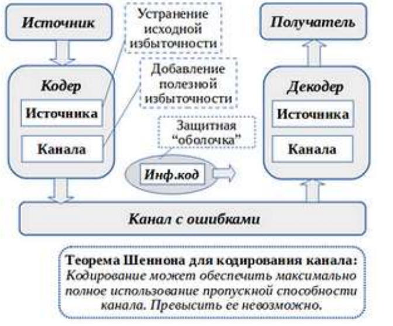
#### Вопрос 04

##### Принципиальные особенности передачи сообщений по дискретному каналу с ошибками.

Способность кода обнаруживать и корректировать ошибки во многом определяется параметром, который называют **минимальным кодовым расстоянием по Хэммингу**.
Пусть $U=(U_0, U_1, U_2,...,U_{n-1})$ - двоичная последовательность длиной n. 

**Число единиц в этой последовательности называется весом Хемминга вектора U и обозначается w(U).** 

Например, вес Хемминга вектора U = ( 1001011 ) равен 4.
Таким образом, чем больше единиц в двоичной последовательности, тем больше ее вес Хемминга.

Далее, пусть U и V будут двоичными последовательностями длиной n.
**Число разрядов, в которых эти последовательности различаются, называется расстоянием Хемминга между U и V и обозначается d(U).**
U = (1001011 ), a V = ( 0100011 ), to d(U,V) = 3.
Задав линейный код, то есть определив все $2^k$ его кодовых слов, можно вычислить расстояние между всеми возможными парами кодовых слов.
Минимальное из них называется минимальным кодовым расстоянием кода и обозначается $d_{min}$.

**Формулы для оценки корректирующей способности:**

Если блочный код имеет минимальное расстояние $d_{min}$, то он может обнаруживать любые сочетания ошибок при их числе, меньшем или равном $r_m=d_{min}$-1, поскольку никакое сочетание ошибок при их числе, меньшем, чем $d_{min}$-1, не может перевести одно кодовое слово в другое.

Ошибки могут иметь кратность и большую, чем $d_{min}$-1, и тогда они останутся необнаруженными.
#### Вопрос 05

##### Суть блочного кодирования.

Кодер **для блочных кодов делит непрерывную информационную последовательность Х на блоки-сообщения длиной k символов**.

Кодер канала преобразует блоки-сообщения Х в более длинные двоичные последовательности Y, состоящие из n символов и называемые кодовыми словами.

Символы **(n-k)**, добавляемые к каждому блоку сообщению кодером, называются избыточными, и их функция состоит в обеспечении возможности обнаруживать (или исправлять) ошибки, возникающие в процессе передачи. 

Таким образом всего $N=2^n$ n-мерных векторов с двоичными компонентами (кодовых комбинаций или
слов).

Из них только $M=2^k$ комбинаций являются разрешёнными и составляют код, который называется
(n‚k) - кодом.

Отношение $R=k/n$ называется относительной скоростью кода.

Остальные комбинации являются запрещёнными, образуются из разрешённых в канале под воздействием помех.
#### Вопрос 06

##### Код с проверкой на четность

Проверка четности – очень простой метод для обнаружения нечетного числа ошибок в передаваемом пакете данных. В каждый передаваемый пакет данных добавляется один бит - бит четности, или, паритетный бит. Паритетный бит _k_ для _n_-битного двоичного слова $b_n \dots b_2 b_1$ вычисляется по формуле:
$$k = b_n \oplus \dots \oplus b_2 \oplus b_1$$
то есть число единиц в пакете всегда будет четно.

На приемной стороне заново рассчитывается бит паритета, если в результате сложение по модулю 2 всех принятых бит кодовой комбинации получается 0, то код не фиксирует ошибку в процессе передачи, в противном случае обнаруживается ошибка в принятых данных.
#### Вопрос 07

**Итеративный код**

Как я понял, данный код представляется в виде матрицы. В матрице находятся информационные разряды. Информационные разряды по строке и по столбцу могут кодироваться различными кодами, например кодом Хэмминга строка, а столбцом проверкой четности.

#### Вопрос 08

**Код Хэмминга**

Представляем в бинарном виде слово, которые хотим закодировать. Далее выбираем длину слова, по которой будем кодировать(я так понял это степени двойки, в примере была длина 16 бит) и разделяем слово на блоки по 16 бит. Образуются некоторые группы, которые будут кодироваться отдельно друг от друга. Находим теперь количество контрольных бит - биты, которые будут добавлены в каждую образовавшуюся группу - ких количество равно 5($16 = 2^4 \rightarrow 4+1$, так как степенью двойки 0 тоже считается). Значение контрольных бит вычисляется: берём каждый контрольный бит и смотрим сколько среди контролируемых им битов единиц, получаем некоторое целое число и, если оно чётное, то ставим ноль, в противном случае ставим единицу. Позиция контрольного бита равна степеням двойки, то есть от 0 до 4.

#### Вопрос 09

**Суть полиномиального кодирования**

Есть множество символов, которое необходимо закодировать. Для этого необходимо представить его в виде многочлена и перемножить с кодирующим многочленом. Получим закодированное множество, представленное в виде многочлена.

#### Вопрос 10

**Общая характеристика циклических кодов**

Циклический код — линейный, блочный код, обладающий свойством цикличности, то есть каждая циклическая перестановка кодового слова также является кодовым словом. Используется для преобразования информации для защиты её от ошибок. 

#### Вопрос 11

**Свойство циклического кода**

Каждая циклическая перестановка кодового слова также является кодовым словом.
#### Вопрос 12

##### Циклические избыточные коды.

Циклический избыточный код (Cyclical Redundancy Check — CRC) имеет фиксированную длину и используется для обнаружения ошибок.

Наибольшее распространения получили коды CRC-16 и CRC-32, имеющие длину 16 и 32 бита соответственно.

Код CRC строится по исходному сообщению произвольной длины, т.е. этот код не является блочным в строгом смысле этого слова. Но при каждом конкретном применении этот код — блочный, (m+16, m) - код для CRC-16 или (m+32, m) - код для CRC-32.

Вычисление значения кода CRC — происходит посредством деления многочлена, соответствующего исходному сообщению (полином сообщение), на фиксированный многочлен (полином-генератор). Остаток от такого деления и есть код CRC, соответствующий исходному сообщению.

Для кода CRC-16 полином-генератор имеет степень 16, а для CRC-32 — 32. Полиномы-генераторы подбираются специальным образом и для кодов — CRC-16/32 стандартизированы Международным консультативным комитетом по телеграфной и телефонной связи (CCITT). Для CRC-16, например, стандартным является полином-генератор х16 + х12 + х5 + 1. 
#### Вопрос 13

##### Код Боуза-Чоудхури-Хоккенгема.

Рассмотренные выше коды ориентированы на конкретные частные результаты: код Хэмминга исправляет однократные ошибки, а циклический — обнаруживает пачки ошибок с заданным ограничением по их длине.

Более общий подход — исправление ошибок любой заданной кратности — обеспечивают коды, созданные по методу Боуза, Чоудхури и Хоквингема (так называемые БЧХ-коды). 

К данному классу относится также популярный код Рида-Соломона, для которого вместо двоичных элементов могут использоваться например 16-ричные цифры. 

БЧХ-код является циклическим кодом, который задается порождающим многочленом g(x). Для построения кода БЧХ необходимо найти этот порождающий многочлен.

Нормированный многочлен — это такой многочлен, коэффициент при старшей степени которого равен 1. Например: $х^3+2х-1$ — нормированный многочлен, а $4х^2$-5 — нет. 

Любой многочлен можно привести к нормированному, разделив его на коэффициент при старшей степени.

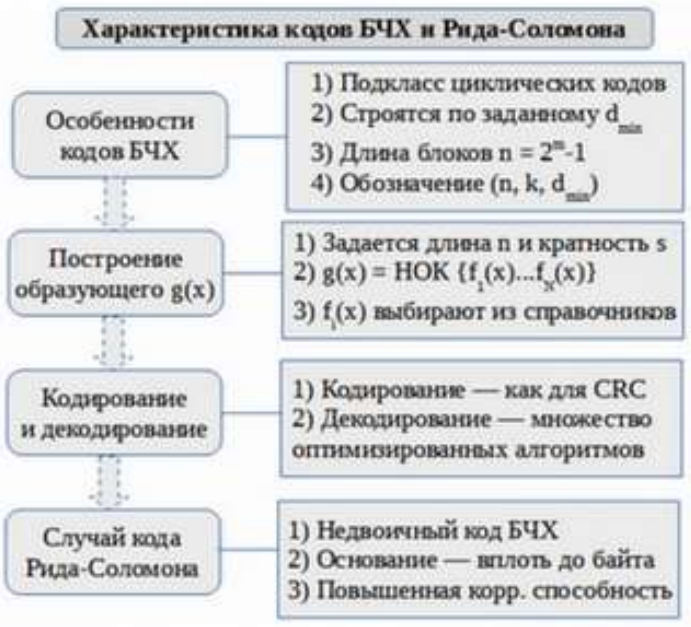
#### Вопрос 14

**Основные характеристики свёрточных кодов**.

**Сверточные коды** — это помехоустойчивые коды, которые используют непрерывную, или последовательную, обработку информации короткими фрагментами.

Сверточные коды обладают памятью, т.к. символы на выходе кодера зависят не только от символов на входе, но и от предыдущих символов, прошедших через кодер. 

Сверточные коды — относятся к категории древовидных кодов.

Основными характеристиками сверточных кодов являются величины:

* $k_0$ — размер кадра информационных символов;
* $n_0$ — размер кадра кодовых символов;
* $m$ — длина памяти кода; 

- $k=(m+1)\cdot k_0$ — информационная длина слова;
- $n= (m+1)\cdot n_0$ — кодовая длина блока (длина кодовой последовательности, на которой сохраняется влияние одного кадра информационных символов);
- $R = k/n$, скорость кода, которая характеризует степень избыточности кода, вводимой для обеспечения исправляющих свойств кода. 
#### Вопрос 15

**Основные элементы свёрточного кодера**.

Основными элементы свёрточного кодера являются:

1. **Регистр сдвига** - динамическое запоминающее устройство, в котором хранятся двоичные символы 0 или 1.

   Число триггерных ячеек m в регистре сдвига и определяет память кода. В момент поступления на вход регистра нового информационного символа символ, хранящийся в крайнем правом разряде, выводится из регистра и сбрасывается.

   

2. **Сумматор по модулю 2** осуществляет сложение поступающих на его входы символов 0 и 1.

   В частности, для двухвходовой схемы
   $0\oplus0=0,1\oplus0=1,0\oplus1=1,1\oplus1=0$,
   где знаком $\oplus$ обозначается сложение по модулю 2.

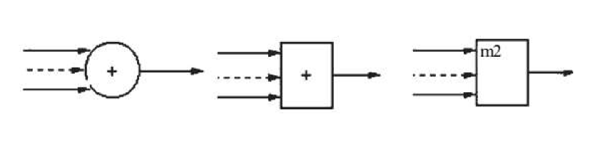

3. **Коммутатор** осуществляет последовательное считывание поступающих на его входы символов и устанавливает на выходе очередность посылки кодовых символов в канал связи.

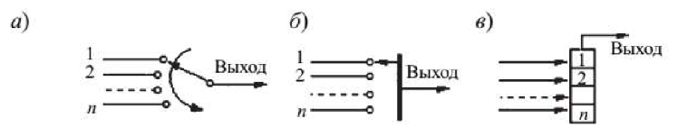

Тактовая частота переключения и число контактов коммутатора определяется **относительной скоростью кода R = R/n**, где k — число информативных символов; n — число передаваемых в канал связи символов за один такт поступления на кодер информационного символа.
#### Вопрос 16

**Диаграмма состояний свёрточного кодера**.

**Сверточный кодер принадлежит к классу устройств называемых конечными автоматами** - это системы обладающие памятью о прошлых событиях (сигналах). 

При этом число состояний, в которых может находиться система - конечно. Состояние отражает информацию о прошлых событиях и определяет возможное поведение системы в будущем.

Состояние должно содержать минимум информации о прошлом на основание которой, совместно с текущими входными данными можно определить данные на выходе.

Из каждого текущего состояния возможны переходы лишь в некоторые из состояний и не возможны в другие.

Для сверточного кода со скоростью 1/n, состояний могут быть представлены содержимым (К-1) младших ячеек регистра.

Поступление следующего элемента будет определять как переход в следующее состояние, так и элементы на выходе кодера.

#### Вопрос 17

**Алгоритм декодирования Витерби**.

Метод представляет собой декодирование по максимуму правдоподобия. Идея алгоритма Витерби состоит в том, что в декодере воспроизводят все возможные пути последовательных изменений состояний сигнала, сопоставляя получаемые при этом кодовые символы с принятыми аналогами по каналу связи и на основе анализа ошибок между принятыми и требуемымисимволами определяют оптимальный путь (оптимальной считается та последовательность, расстояние Хемминга которой от принятой последовательности минимально).

Декодирование по методу Витерби, по существу, представляет собой алгоритм поиска наивыгоднейшего, максимально правдоподобного пути на графе — решеточной диаграмме кода.

Задача декодирования сверточного кода заключается в выборе пути ВДОЛЬ решетки наиболее похожего на принятую последовательность. В нашем случае (2,1,3) каждому информационному элементу соответствует кодовое слово из n=2 элементов.

Каждый путь вдоль решетки складывается из ветвей соединяющих узлы.

Каждой ветви решетки соответствует кодовое слово из двух бит. 

Каждую ветвь на каждом периоде можно пометить расстоянием Хемминга между полученным кодовым словом и кодовым словом, соответствующим ветви. 

Складывая расстояния Хемминга ветвей, составляющих путь, получим метрику соответствующего пути.

Данная метрика будет характеризовать степень подобия каждого пути принятой последовательности. Чем меньше метрика, тем более похожи путь и принятая последовательность.

Т.е. результатом декодирования будет информационная последовательность, соответствующая пути с минимальной метрикой.

Если в одно и тоже состояние входят два пути выбирается тот, который имеет лучшую метрику. Такой путь называется выжившим. Отбор выживших путей проводится для каждого состояния.
### Раздел 5

#### Вопрос 01

##### Идентификация, аутентификация и авторизация.

**Идентификация** - процедура, в результате выполнения которой для субъекта идентификации выявляется его идентификатор, однозначно определяющий этого субъекта в информационной системе.

**Аутентификация** - процедура проверки подлинности, например, проверка подлинности пользователя путем сравнения введенного им пароля с паролем, сохраненным в базе данных.

**Авторизация** - предоставление определенному лицу или группе лиц прав на выполнение определенных действий.
#### Вопрос 02

##### Модели информационной безопасности.

Принято выделять три главных модели информационной безопасности:

- концептуальную;
- математическую; 
- функциональную;

**Концептуальная модель** отвечает на общие вопросы и отражает схематично общую структуру модели информационной безопасности, на которой как на стержне строятся остальные модели и концепции информационной безопасности.

**Математическая модель** представляет собой формализованное описание сценариев действий нарушителей, принимаемых ответных мер.

В **функциональной модели** информационной безопасности, которая создается на базе уже сформированной математической модели, воплощаются, внедряются конкретные меры по защиты используемой инфосистемы.
#### Вопрос 03

##### Уязвимость, угроза, атака.

**Уязвимость** - недостаток (слабость) программного (программно-технического) средства или информационной системы в целом, которые могут быть использованы для реализации угроз безопасности информации.

**Угроза** - совокупность условий и факторов, создающих потенциальную или реально существующую опасность нарушения безопасности информации.

**Атака** - это совокупность преднамеренных действий злоумышленника, направленных на нарушение одного из трех свойств информации — доступности, целостности или конфиденциальности.
#### Вопрос 04

##### Типы и примеры атак.

*(Прим. Материал взят из Лекции 14)*

Контуры безопасности:

- Некритичный;
- Подконтрольный;
- Сверхкритичный.

**Атака на уровень некритичного контура**. Примеры:

- Вирусное ПО;
- Врезка в канал передачи данных на территории объекта;
- Атака на ПК, расположенные в АБК.

**Атака на уровень подконтрольного контура**. Примеры:

- Внедрение в канал связи;
- Недокументированные возможности оборудования и ПО.

**Атака на уровень сверхкритичного контура**. Примеры:

- Неверные управляющие действия персонала.
#### Вопрос 05

##### Иерархия средств защиты.

- **Технические (аппаратные)** средства. Это различные по типу устройства, которые аппаратными средствами решают задачи защиты информации. Либо препятствуют физическому проникновению, либо, если проникновение все же состоялось, доступу к информации, в т.ч. с помощью её маскировки.
- **Программные** средства включают программы для идентификации пользователей, контроля доступа, шифрования информации, удаления остаточной (рабочей) информации типа временных файлов, тестового контроля системы защиты и др.
- **Организационные** средства складываются из организационно-технических (подготовка помещений с компьютерами, прокладка кабельной системы с учетом требований ограничения доступа к ней и др.) и организационно-правовых (национальные законодательства и правила работы, устанавливаемые руководством конкретного предприятия).
- **Смешанные аппаратно-программные** средства реализуют те же функции, что аппаратные и программные средства в отдельности, и имеют промежуточные свойства.
#### Вопрос 06

##### Технологии безопасности на основе анализа сетевого трафика.

- Прокси-серверы;
- Системы выявления и предотвращения угроз взлома;
- Средства защиты от целевых атак;
- Межсетевые экраны;
- Системы сетевого мониторинга;
- VPN.
#### Вопрос 07

##### Системы мониторинга трафика.

К **системам мониторинга сети** относятся программные и аппаратные средства, способные отслеживать различные аспекты сети и ее работы, такие как трафик, использование полосы пропускания и время безотказной работы. Такие системы могут обнаруживать устройства и другие элементы, которые составляют сеть или связаны с ней, а также обеспечивают обновление статуса.

Протоколы — это наборы правил и указаний для обмена данными между устройствами в сети. Сетевое оборудование не может передавать данные без использования протоколов. Системы мониторинга сети используют протоколы, чтобы выявлять проблемы с производительностью сети и сообщать о них.
#### Вопрос 13

##### Основные принципы проектирования защиты сетей АСУТП.

* Решение должно быть комплексным и максимально стабильным
* Решение от единого вендора — удобно внедрять, удобно поддерживать, удобно управлять. Как следствие — снижение стоимости владения
* Решение должно быть очень гибким, чтобы иметь возможность подстраиваться под любые АСУ ТП и техпроцессы Заказчика, в том числе и те, которые еще не защищены
* НО ГЛАВНОЕ:
  * Решение никак не должно влиять на нормальное функционирование АСУ ТП
  * Решение должно полностью обеспечивать защиту Объекта защиты
