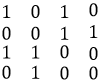

#### Задание 03

##### Осуществить кодирование данных с помощью итеративного кода для информационной последовательности 101001110.

**Решение**

1. Разбиваем исходную последовательность на блоки равной длины. При невозможности сформировать такие блоки допускается дополнить недостающие разряды нулями.

$$
101001110 \rightarrow 101 \; 001 \; 110
$$
2. Полученные блоки помещаются в матрицу (обычно используется квадратная матрица):

3. Для каждого блока вычисляется контрольный разряд по правилу суммирования по модулю 2. Суммирование выполняется по строкам и столбцам. Полученные кодовые разряды помещаются в конце строки или столбца соответственно. Элемент $[n,n]$ формируется путём суммирования $n$-й строки и $n$-го столбца, где $n$ - размерность матрицы.

4. Закодированная комбинация формируется путём последовательного выписывания строк получившейся матрицы: 
$$
1010 \; 0011 \; 1100 \; 0100
$$