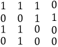

#### Задание 04

##### Провести проверку принятых данных 1110 0011 1100 0100 закодированных с помощью итеративного кода (длина блока 3).

1. Полученная кодовая комбинация помещается в матрицу:

2. Выполняется проверка по строкам и столбцам, аналогично кодированию *(прим. См. предыдущее задание)*:

Проверка для 1-й строки: $1 \oplus 1 \oplus 1 \ne 0$

Проверка для 2-й строки: $0 \oplus 1 \oplus 1 = 0$

Проверка для 3-й строки: $1 \oplus 1 \oplus 0 = 0$

Проверка для 1-го столбца: $1 \oplus 0 \oplus 1 = 0$

Проверка для 2-го столбца: $1 \oplus 0 \oplus 1 \ne 1$

Проверка для 3-го столбца: $0 \oplus 1 \oplus 0 = 1$

Проверка элемента $(4, 4)$: $0 \oplus 1 \oplus 0 \oplus 0 \oplus 1 \oplus 0 = 0$

3. Если проверка не выполняется, строка и столбец помечаются. В данном случае это cтрока 2 и столбец 2.

4. Искажённые разряды находятся на пересечении помеченных строк и столбцов.

5. Таким образом, на месте элемента $(1,2)$ вместо 1 должен быть 0.