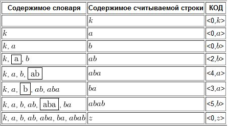

#### Задание 09

##### Провести кодирование последовательности символов «kababababaababz» по методу Лемпеля-Зива (LZ78).

**Описание алгоритма LZ78**

Используется словарь из уже просмотренных фраз. Алгоритм считывает символы сообщения до тех пор, пока накапливаемая подстрока входит целиком в одну из фраз словаря. Как только эта строка перестанет соответствовать хотя бы одной фразе словаря, алгоритм генерирует код, состоящий из индекса строки в словаре, которая до последнего введенного символа содержала входную строку, и символа, нарушившего совпадение.

Затем в словарь добавляется введенная подстрока. Если в конце алгоритма мы не находим символ, нарушивший совпадения, то тогда мы выдаем код в виде (индекс строки в словаре без последнего символа, последний символ).

**Решение**

Результатом кодирования является список пар:

$$
[<0,k>;<0,a>;<0,b>;<2,b>;<4,a>;<3,a>;<5,b>;<0,z>]
$$