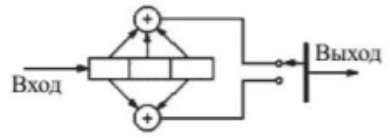

#### Задание 10

##### Для сверточного кодера $(2,1,3)$ (схема приведена на рис.1) получить закодированный сигнал, если на вход поступает информационная последовательность символов 101.

Кодируется последовательность символов 101, следовательно, ей соответствует многочлен $A(x) = 1 + x^2$.

У кодера, изображенного на рисунке, имеются два порождающих многочлена:

$$
G_1(x) = 1 + x + x^2, \;\;\;\;\; G_2(x) = 1 + x^2
$$

На выходе первого сумматора кодера
последовательность кодовых символов будет
11011, т.к. ей соответствует многочлен

$$
B_1(x) = G_1(x)A(x) = (1+x+x^2)(1+x^2) = 1+x+x^3+x^4
$$

На выходе второго сумматора кодера
последовательность кодовых символов будет
10001, т.к. ей соответствует многочлен

$$
B_2(x) = G_2(x)A(x) = (1+x^2)(1+x^2) = 1+x^4.
$$

В итоге на выходе кодера будет сформирована
последовательность $B(x)$ выходных символов за 5
тактов нахождения входной последовательности
101 в трехразрядном регистре:

Получили следующую закодированную последовательность: **11 10 00 10 11**.