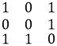
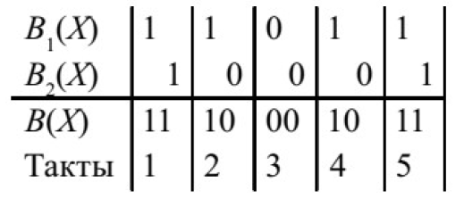

### Задания

#### Задание 01

##### Построить методом Хаффмана оптимальный код для алфавита со следующим распределением вероятностей появления символов в тексте: А–0,4; Б – 0,2; В – 0,2; Г – 0,15; Д – 0,05.

**Описание метода Хаффмана**

*1-й этап - построение двоичного дерева*. Будем строить двоичное дерево с $m$ листьями, начиная с листьев и продвигаясь к корню. Возьмём в качестве листьев дерева символы $a_1, \dotsc , a_m$, которым приписаны вероятности $p_1, \dotsc , p_m$.

Основная операция алгоритма - *редукция* - состоит в следующем. Возьмём две вершины $a_{m-1}$ и $a_m$ с *наименьшими* вероятностями $p_{m-1}$ и $p_m$ и добавим в дерево новую вершину $a_{m-1} \cup a_m$, которой припишем вероятность $p_{m-1} + p_m$. Вершину $a_{m-1} \cup a_m$ соединим рёбрами с вершинами $a_{m-1}$ и $a_m$ и объявим общим предком для этих вершин. Ребро от $a_{m-1} \cup a_m$ к $a_{m-1}$ пометим символом 0, а ребро от $a_{m-1} \cup a_m$ к $a_m$ - символом 1. Получаем новый (редуцированный) алфавит $\mathscr{A}^{(1)} = \{a_1, \dotsc , a_{m-2}, a_{m-1} \cup a_m\}$ с набором вероятностей $\vec{p}^{(1)} = (p_1, \dotsc , p_{m-2}, p_{m-1} + p_m)$.

Если в полученном алфавите $\mathscr{A}^{(1)}$ не менее двух символов, то упорядочим эти символы в порядке невозрастания вероятностей набора $\vec{p}^{(1)}$ и снова применим операцию редукции.

Если же алфавит $\mathscr{A}^{(1)}$ состоит из одного символа с приписанной ему вероятностью 1, то этот символ объявим корнем и завершим этап построения дерева.

*2-й этап - кодирование*. Чтобы получить кодовое слово $\varphi (a_j)$ для символа $a_j$, последовательно считываем метки рёбер на пути от корня дерева к листу $a_j$.

**Решение**

$$
\varphi (А) = 00 \;\;\; \varphi (Б) = 01 \;\;\; \varphi (В) = 10 \;\;\; \varphi (Г) = 110 \;\;\; \varphi (Д) = 111
$$
#### Задание 02

##### Построить методом Шеннона-Фано оптимальный код для алфавита со следующим распределением вероятностей появления символов в тексте: А – 0,4; Б – 0,2; В – 0,2; Г – 0,15; Д – 0,05.

**Описание метода Шеннона-Фано**

Выберем число $k, 1\le k < m$, так, чтобы величина

$$
\left| \sum_{i=1}^k p_i - \sum_{i=k+1}^m p_i \right|
$$

была минимальной. Разобьём множество $\mathscr{A}=\{a_1, \dots , a_m\}$ на подмножества: $\mathscr{A} = \mathscr{A}_0 \cup \mathscr{A}_1$, где $\mathscr{A}_0 = \{a_1, \dots, a_k\}$, $\mathscr{A}_1 = \{a_{k+1}, \dots, a_m\}$.

Следующие шаги алгоритма определим индуктивно. Предположим, что уже задано подмножество $\mathscr{A}_{i_1, \dots , i_t} \subseteq \mathscr{A}$, где $i_1, \dots , i_t \in \mathscr{B}$.

Если подмножество $\mathscr{A}_{i_1, \dots , i_t}$ состоит из единственного символа $a_j$, то для этого символа определяем кодирование $\varphi (a_j) = i_1 \dots i_t$. Если же в подмножестве $\mathscr{A}_{i_1, \dots , i_t} = \{a_j, \dots , a_s\}$ не менее двух символов, то выберем число $k, j\le k < s$, так, чтобы минимизировать величину

$$
\left| \sum_{i=j}^k p_i - \sum_{i=k+1}^s p_i \right|
$$

и разобьём множество $\mathscr{A}_{i_1, \dots , i_t}$ на подмножества $\mathscr{A}_{i_1, \dots , i_t,0} = \{a_j, \dots a_k\}$ и $\mathscr{A}_{i_1, \dots , i_t,1} = \{a_{k+1}, \dots , a_s\}$.

Процесс разбиения на подмножества продолжается, пока не получим все одноэлементные подмножества и тем самым не определим кодирование $\varphi$ всюду на алфавите $\mathscr{A}$.

**Решение**

$$
\varphi (А) = 00 \;\;\; \varphi (Б) = 01 \;\;\; \varphi (В) = 10 \;\;\; \varphi (Г) = 110 \;\;\; \varphi (Д) = 111
$$
#### Задание 03

##### Осуществить кодирование данных с помощью итеративного кода для информационной последовательности 101001110.

**Решение**

1. Разбиваем исходную последовательность на блоки равной длины. При невозможности сформировать такие блоки допускается дополнить недостающие разряды нулями.

$$
101001110 \rightarrow 101 \; 001 \; 110
$$
2. Полученные блоки помещаются в матрицу (обычно используется квадратная матрица):

3. Для каждого блока вычисляется контрольный разряд по правилу суммирования по модулю 2. Суммирование выполняется по строкам и столбцам. Полученные кодовые разряды помещаются в конце строки или столбца соответственно. Элемент $[n,n]$ формируется путём суммирования $n$-й строки и $n$-го столбца, где $n$ - размерность матрицы.

4. Закодированная комбинация формируется путём последовательного выписывания строк получившейся матрицы: 
$$
1010 \; 0011 \; 1100 \; 0100
$$
#### Задание 04

##### Провести проверку принятых данных 1110 0011 1100 0100 закодированных с помощью итеративного кода (длина блока 3).

1. Полученная кодовая комбинация помещается в матрицу:

2. Выполняется проверка по строкам и столбцам, аналогично кодированию *(прим. См. предыдущее задание)*:

Проверка для 1-й строки: $1 \oplus 1 \oplus 1 \ne 0$

Проверка для 2-й строки: $0 \oplus 1 \oplus 1 = 0$

Проверка для 3-й строки: $1 \oplus 1 \oplus 0 = 0$

Проверка для 1-го столбца: $1 \oplus 0 \oplus 1 = 0$

Проверка для 2-го столбца: $1 \oplus 0 \oplus 1 \ne 1$

Проверка для 3-го столбца: $0 \oplus 1 \oplus 0 = 1$

Проверка элемента $(4, 4)$: $0 \oplus 1 \oplus 0 \oplus 0 \oplus 1 \oplus 0 = 0$

3. Если проверка не выполняется, строка и столбец помечаются. В данном случае это cтрока 1 и столбец 2.

4. Искажённые разряды находятся на пересечении помеченных строк и столбцов.

5. Таким образом, на месте элемента $(1,2)$ вместо 1 должен быть 0.
#### Задание 05

##### Вычислить CRC код (порождающий полином $x^4+x+1$) для информационной последовательности 11000100110101.

Вычисление значения кода CRC происходит посредством деления многочлена, соответствующего исходному сообщению (полином сообщение), на фиксированный многочлен (полином-генератор). В нашем случае просто выполняется последовательное сложение по модулю 2. Перед этим к сообщению добавляется $(n-1)$ нулевых бит, где $n$ – длина порождающего полинома.

Остаток от такого деления и есть код CRC, соответствующий исходному сообщению.

К исходному сообщению на место добавленных в самом начале $(n-1)$ нулей записывается CRC код (т.е. с $(n-1)$ добавленными нулями выполняется логическое сложение полученного CRC кода). CRC код: 1001

Итоговая последовательность: 11000100110101**1001**

#### Задание 06

##### Провести проверку принятых данных 100001001101010111, закодированных с помощью CRC кода (порождающий полином $х^4+х+1$).

Проверка данных производится путём вычисления остатка от деления закодированной последовательности на порождающий многочлен. В нашем случае просто выполняется последовательное сложение по модулю 2. Если в полученной последовательности отсутствуют ошибки, то в результате должна быть получена последовательность из нулей.

Полученная в результате последовательность содержит единицы, следовательно, данные приняты с ошибкой.
#### Задание 07

##### Осуществить кодирование данных с помощью кода Хэмминга (4,3) для информационной последовательности 0101.

**Примечание**. В условии возможно опечатка, и, скорее всего, имеется ввиду код $(7, 4)$. Тогда $n=7,m=4$.

Количество контрольных разрядов $k$ должно быть выбрано так, чтобы удовлетворялось неравенство:

$$
k \ge \log_2(k+m+1)
$$

- $m$ – количество информационных символов в сообщении; 
- $n$ - количество символов в сообщении. Числа $m$ и $n$ берутся из маркировки $(n, m)$.

$3≥log_2⁡(3+4+1)$, следовательно, $k=3$.

Проверочные биты располагаются на позициях, равным степеням двойки в порядке возрастания: первый проверочный бит на позиции 1, второй проверочный бит на позиции 2, третий проверочный бит на позиции 4.

| Номер позиции | 7 | 6 | 5 | 4 | 3 | 2 | 1 |
|:-------------:|:-:|:-:|:-:|:-:|:-:|:-:|:-:|
|Значение|$i_4=0$|$i_3=1$|$i_2=0$|$k_3$|$i_1=1$|$k_2$|$k_1$|

Определим, какие группы информационных бит контролируют проверочные биты:

- Номер позиции $i_1$ равен 3, значит, $3=2^0+2^1=1+2$, поэтому информационный бит контролируется битами $k_1$ и $k_2$;

- Номер позиции $i_2$ равен 5, значит, $5=2^0+2^2=1+4$, поэтому информационный бит контролируется битами $k_1$ и $k_3$;

- Номер позиции $i_3$ равен 6, значит, $6=2^1+2^2=2+4$, поэтому информационный бит контролируется битами $k_2$ и $k_3$;

- Номер позиции $i_4$ равен 7, значит, $7=2^0+2^1+2^2=1+2+4$, поэтому информационный бит контролируется битами $k_1$, $k_2$ и $k_3$.

Рассчитаем значения проверочных символов: 

$$
k_1= i_1 \oplus i_2 \oplus i_4=1 \oplus 0 \oplus 0=1
$$

$$
k_2= i_1 \oplus i_3 \oplus i_4=1 \oplus 1 \oplus 0=0
$$

$$
k_3= i_2 \oplus i_3 \oplus i_4=0 \oplus 1 \oplus 0=1
$$

Таким образом, закодированная последовательность имеет вид: **0101101**.
#### Задание 08

##### Провести проверку принятых данных 0101101 закодированных с помощью кода Хэмминга (4,3).

**Примечание**. В условии возможно опечатка, и, скорее всего, имеется ввиду код $(7, 4)$.

Вычисляем значения проверочных символов на основании принятых данных:

| Номер позиции | 7 | 6 | 5 | 4 | 3 | 2 | 1 |
|:-------------:|:-:|:-:|:-:|:-:|:-:|:-:|:-:|
| Значение | $i_4=0$ | $i_3=1$ | $i_2=0$ | $k_3=1$ | $i_1=1$ | $k_2=0$ | $k_1=1$ |

$$ k_1 = i_1 \oplus i_2 \oplus i_4 = 1 \oplus 0 \oplus 0 = 1 $$

$$ k_2 = i_1 \oplus i_3 \oplus i_4 = 1 \oplus 1 \oplus 0 = 0 $$

$$ k_3 = i_2 \oplus i_3 \oplus i_4 = 0 \oplus 1 \oplus 0 = 1 $$

Следовательно, принятая комбинация не имеет ошибок.
Если бы комбинация содержала ошибку, то можно было бы вычислить номер неверно принятого бита. Для этого вычисляется синдром $S=s_3 s_2 s_1$:
$$ s_1 = k_1 \oplus k'_1 $$
$$ s_2 = k_2 \oplus k'_2 $$
$$ s_3 = k_3 \oplus k'_3 $$

После этого полученное двоичное число $s_3 s_2 s_1$ переводится в десятичное – номер искажённого бита:
$$
S=s_3 \cdot 2^2 + s_2 \cdot 2^1 + s_1 \cdot 2^0
$$
#### Задание 09

##### Провести кодирование последовательности символов «kababababaababz» по методу Лемпеля-Зива (LZ78).

**Описание алгоритма LZ78**

Используется словарь из уже просмотренных фраз. Алгоритм считывает символы сообщения до тех пор, пока накапливаемая подстрока входит целиком в одну из фраз словаря. Как только эта строка перестанет соответствовать хотя бы одной фразе словаря, алгоритм генерирует код, состоящий из индекса строки в словаре, которая до последнего введенного символа содержала входную строку, и символа, нарушившего совпадение.

Затем в словарь добавляется введенная подстрока. Если в конце алгоритма мы не находим символ, нарушивший совпадения, то тогда мы выдаем код в виде (индекс строки в словаре без последнего символа, последний символ).

**Решение**

Результатом кодирования является список пар:

$$
[<0,k>;<0,a>;<0,b>;<2,b>;<4,a>;<3,a>;<5,b>;<0,z>]
$$
#### Задание 10

##### Для сверточного кодера $(2,1,3)$ (схема приведена на рис.1) получить закодированный сигнал, если на вход поступает информационная последовательность символов 101.

Кодируется последовательность символов 101, следовательно, ей соответствует многочлен $A(x) = 1 + x^2$.

У кодера, изображенного на рисунке, имеются два порождающих многочлена:

$$
G_1(x) = 1 + x + x^2, \;\;\;\;\; G_2(x) = 1 + x^2
$$

На выходе первого сумматора кодера последовательность кодовых символов будет 11011, т.к. ей соответствует многочлен
$$
B_1(x) = G_1(x)A(x) = (1+x+x^2)(1+x^2) = 1+x+x^3+x^4
$$

На выходе второго сумматора кодера последовательность кодовых символов будет 10001, т.к. ей соответствует многочлен

$$
B_2(x) = G_2(x)A(x) = (1+x^2)(1+x^2) = 1+x^4.
$$

В итоге на выходе кодера будет сформирована последовательность $B(x)$ выходных символов за 5 тактов нахождения входной последовательности 101 в трехразрядном регистре:

Получили следующую закодированную последовательность: **11 10 00 10 11**.
